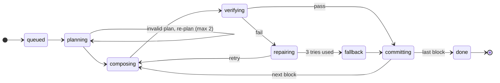

# Circuit Forge — Low-Level Design

## 1. Scope and performance budgets

v1 is a schematic-first circuit tutor for analog fundamentals. The AI composes circuits from verified blocks and streams them as ops; the browser lays them out, animates them and simulates them with ngspice-WASM; a tutor answers questions grounded in live simulation values. Backend is Python (FastAPI); circuit rules live in one Rust crate (`circuit-core`) shared by browser and server.

**In scope (v1):** schematic view, op protocol, plan → compose → verify generation, click-to-ask, user editing with undo/redo, browser simulation (OP, DC sweep, AC, transient), \~150 parts, \~60 verified block templates, accounts and saved projects.

**Out of scope (v1):** breadboard view (v2), microcontroller/firmware simulation, PCB layout, multiplayer, open-ended “discovery” mode.

**Hard limits (v1):** 300 parts, 8 blocks, 400 nets per circuit; 2 s server simulation timeout; 3 repair attempts per block.

| Metric | Target (p95) |
| --- | --- |
| First narration token after Generate | < 1.5 s |
| First committed block on screen | < 6 s |
| Full 4-block circuit committed | < 25 s |
| Local op validation (circuit-core WASM) | < 1 ms |
| Re-simulation after an edit (≤ 50 parts) | < 150 ms |
| Ask: first answer token | < 1.2 s |
| Schematic pan/zoom at 300 parts | 60 fps |
| Token budget per generated circuit | ≤ 40k input + 6k output |
| API process memory per pod | < 512 MB |

## 2. Repository and module layout

One monorepo, three languages, one source of truth: the Rust crate `circuit-core` defines every type on the wire, and everything else is generated from it or calls into it.

```text
circuit-tutor/
├─ crates/
│  ├─ circuit-core/          # IR, ops, apply(), ERC, SPICE compiler — pure, no I/O
│  ├─ circuit-core-wasm/     # wasm-bindgen facade → npm package @tutor/core
│  └─ circuit-core-py/       # PyO3 facade → wheel `circuit_core` (maturin)
├─ contract/schema/          # JSON Schema exported by schemars (generated, committed)
├─ apps/
│  ├─ web/src/               # React + Vite client
│  │  ├─ store/              # circuitStore, opLog, selection, history
│  │  ├─ stream/             # SSE client, NDJSON line parser
│  │  ├─ anim/               # AnimationDirector (GSAP timeline)
│  │  ├─ views/schematic/    # SVG renderer, hit-testing, overlays
│  │  ├─ workers/            # layout.worker.ts (ELK.js), sim.worker.ts (ngspice WASM)
│  │  ├─ tutor/              # ContextBuilder, AskPanel
│  │  └─ gen/                # generated TS types (do not edit)
│  └─ api/tutor_api/         # Python FastAPI service
│     ├─ main.py             # app factory, lifespan, routers
│     ├─ routers/            # generate.py, jobs.py, ask.py, projects.py, registry.py
│     ├─ orchestrator/       # job.py, planner.py, composer.py, verifier.py, repair.py
│     ├─ tutor/              # context.py, service.py
│     ├─ llm/                # gateway.py, providers/, prompts/*.jinja
│     ├─ sim/                # client.py (enqueue + await result)
│     ├─ retrieval/          # parts.py, templates.py (pgvector)
│     ├─ db/                 # SQLAlchemy models, Alembic migrations
│     └─ models/             # generated Pydantic v2 models (do not edit)
├─ workers/sim_runner/       # arq worker: ngspice subprocess runner
├─ registry/                 # parts/*.yaml, symbols/*.svg, models/*.lib, templates/*.yaml
├─ third_party/ngspice/      # pinned source + Emscripten build script
└─ evals/                    # prompts.yaml, run_evals.py, golden/
```

| Deployable | Runtime | Scaling | State |
| --- | --- | --- | --- |
| `web` | Static bundle on CDN | CDN | None (IndexedDB in browser) |
| `api` | FastAPI on Uvicorn, 1 process per container | Horizontal, by open SSE streams | Stateless; job state in Redis + Postgres |
| `sim_runner` | arq worker + ngspice binary | Horizontal, by queue depth | None |
| `registry` | Versioned bundle on CDN | CDN | Immutable per version |
| Postgres 16 + pgvector | Managed | Vertical, read replica later | Users, projects, op logs, templates |
| Redis 7 | Managed | Single primary | Queues, job events, rate limits, caches |

**Dependency rules (enforced in CI):**

- `circuit-core` has no I/O, no clock, no randomness: same input, same output, on every runtime.
- The API never mutates IR by hand; every change goes through `circuit_core.apply(ir, op)`.
- Generated code (`apps/web/src/gen`, `apps/api/tutor_api/models`) is regenerated in CI and the build fails on any diff.
- ngspice version is pinned once and used for both the WASM build and the `sim_runner` image.

## 3. circuit-core: the Circuit IR

The IR is a pure netlist with semantics and no geometry. Positions are computed by the layout engine; the only stored coordinate is `pinned`, which only a user drag can set.

```rust
// crates/circuit-core/src/ir.rs
pub type PartId = String;   // registry id, e.g. "opamp_tl072"
pub type RefDes = String;   // instance id, e.g. "U1", "R3"
pub type NetId = String;    // "N_VOUT"; "GND" is reserved
pub type BlockId = String;  // "b2"

#[derive(Serialize, Deserialize, JsonSchema, Clone, Debug)]
pub struct Circuit {
    pub schema_version: u16,          // 1
    pub registry_version: String,     // "2025.06.0" — fixes symbols, pin maps, models
    pub rev: u64,                     // +1 per applied op
    pub parts: IndexMap<RefDes, PartInstance>,
    pub nets: IndexMap<NetId, Net>,
    pub blocks: IndexMap<BlockId, Block>,
    pub analyses: Vec<Analysis>,
    pub hints: Vec<LayoutHint>,
}

pub struct PartInstance {
    pub refdes: RefDes,
    pub part: PartId,
    pub params: BTreeMap<String, Quantity>, // "resistance" -> 10kΩ
    pub block: Option<BlockId>,
    pub origin: Origin,                     // Llm { job_id } | User | Template { id }
    pub pinned: Option<Placement>,          // user drag only
}

pub struct Quantity { pub si: f64, pub unit: Unit, pub display: String } // parsed from "10k"

pub struct Net {
    pub id: NetId,
    pub pins: BTreeSet<PinRef>,             // serialized as "R3.1", "U1.OUT_A"
    pub kind: NetKind,                      // Signal | Power { volts } | Ground
    pub label: Option<String>,
}

pub struct Block {
    pub id: BlockId,
    pub role: BlockRole,                    // Supply | Source | Amplifier | Filter | ...
    pub title: String,
    pub spec: BTreeMap<String, SpecTarget>, // "fc_hz": { target: 1000, tol_pct: 10 }
    pub ports: Vec<BlockPort>,              // named interface nets: "in", "out", "vcc"
    pub status: BlockStatus,                // Planned | Composing | Verified | Committed | Failed
    pub template: Option<String>,
}

pub enum Analysis {
    Op,
    Dc { source: RefDes, start: f64, stop: f64, step: f64 },
    Ac { points_per_decade: u32, f_start: f64, f_stop: f64 },
    Tran { t_step: f64, t_stop: f64 },
}

pub enum LayoutHint { Flow(Direction), Near(RefDes, RefDes), Group(BlockId) }
```

**Invariants checked by `apply()` on every op:**

1. Every `PinRef` names an existing part and a pin that exists in that part’s registry pin map.
2. A pin belongs to at most one net; connecting it elsewhere is an explicit `net.move_pin`.
3. Exactly one ground net, `GND`.
4. `refdes` is unique and its prefix matches the part category (R, C, L, D, Q, U, V, J).
5. Every param is declared in the part’s registry param schema and within its `min`/`max`.
6. Values arrive as strings (`"4.7u"`, `"2.2meg"`); only circuit-core parses units, so the browser and server never disagree.

## 4. Op protocol

Every change to a circuit, by the LLM or the user, is one op with the same envelope, applied by the same `apply()` function. The circuit is the fold of its op log.

```json
{"v":1, "seq":42, "op":"part.add", "author":"llm", "job":"j_8f2", "block":"b2", "base_rev":17,
 "body":{"refdes":"R3", "part":"resistor_th", "params":{"resistance":"10k"}}}
```

| Op | Body | Inverse (undo) | Who emits |
| --- | --- | --- | --- |
| `block.begin` | id, role, title, spec, ports | `block.remove` | LLM |
| `block.commit` | id | status back to Verified | LLM |
| `block.abort` | id, reason | — (block discarded client-side) | LLM |
| `part.add` | refdes, part, params, block? | `part.remove` | LLM, user |
| `part.remove` | refdes | `part.add` + its `net.connect`s | LLM repair, user |
| `part.set_param` | refdes, key, value | `part.set_param` (old value) | LLM, user |
| `part.swap` | refdes, part (pins remapped by name) | `part.swap` (old part) | user |
| `net.connect` | net, pins\[\], kind? | `net.disconnect` | LLM, user |
| `net.disconnect` | net, pins\[\] | `net.connect` | LLM repair, user |
| `net.rename` | from, to | `net.rename` (reversed) | user |
| `part.pin` | refdes, placement or null | previous placement | user |
| `analysis.set` | analyses\[\] | previous analyses | LLM, user |
| `hint.add` | hint | `hint.remove` | LLM |
| `narrate` | refs\[\], text, block? | — (not an IR change) | LLM |

**Apply semantics:**

- `apply(circuit, op) -> Result<(Circuit, InverseOp), OpError>` is atomic: an op lands whole or not at all, and returns its inverse for undo.
- Ops between `block.begin` and `block.commit` form one transaction: one undo step removes the whole block.
- `narrate` ops never touch the IR. They go to a lesson track keyed by block, so any lesson can be replayed with its narration.
- **v1 is single-writer.** While a generation job streams, the editor is read-only (selection and Ask still work). This removes all merge logic; Yjs-based concurrent editing is a v2 change.
- `base_rev` must equal `circuit.rev`; otherwise the op is rejected with `stale_rev` and the client resyncs from the server snapshot.
- Versioning: the server accepts envelope `v` and `v-1`. Within a major version, changes are additive only; an unknown op is rejected, never ignored.

**Error codes** (returned to the LLM verbatim during repair, shown to users as friendly text): `part_not_in_registry`, `pin_not_found`, `pin_already_connected`, `param_out_of_range`, `refdes_conflict`, `block_not_open`, `stale_rev`, `unknown_op`, `limit_exceeded`.

## 5. Wire protocol: REST and SSE

REST for commands and snapshots, Server-Sent Events for anything streamed. Every streamed event is persisted in a Redis Stream first, so a dropped connection resumes with `Last-Event-ID` and loses nothing.

| Method | Path | Purpose | Returns |
| --- | --- | --- | --- |
| POST | `/v1/projects` | Create a project | Project |
| GET | `/v1/projects/{id}` | Snapshot: circuit, rev, lesson track | Snapshot |
| POST | `/v1/projects/{id}/ops` | Append user ops `{base_rev, ops[]}` | `{rev}` or 409 `stale_rev` |
| POST | `/v1/projects/{id}/generate` | Start a job `{prompt, mode, level}` | 202 `{job_id}` |
| GET | `/v1/jobs/{job_id}/events` | Job event stream, resumable | `text/event-stream` |
| POST | `/v1/jobs/{job_id}/cancel` | Cancel a running job | 202 |
| POST | `/v1/projects/{id}/ask` | Tutor question, answer streamed | `text/event-stream` |
| GET | `/v1/registry/{version}/manifest` | Registry manifest (CDN redirect) | 302 |
| GET | `/v1/me/usage` | Remaining generation quota | Usage |

**SSE event types on `/jobs/{id}/events`:**

| Event | Data | Client action |
| --- | --- | --- |
| `job.state` | state, block? | Update progress UI |
| `narration.delta` | block?, text | Append to narration panel |
| `block.ghost` | id, title, role, ports | Draw a dashed placeholder |
| `op` | one op envelope | Validate locally, enqueue to AnimationDirector |
| `block.repair` | id, attempt, error codes | Show “fixing a wiring issue…” |
| `sim.summary` | block, checks\[{name, target, measured, pass}\] | Show spec badge on block |
| `error` | code, message, retryable | Toast; offer retry if retryable |
| `done` | rev, usage{in\_tokens, out\_tokens} | Unlock editor |
| `heartbeat` | — (every 15 s) | Reset stall timer |

```text
id: 57
event: op
data: {"v":1,"seq":57,"op":"net.connect","author":"llm","block":"b2","base_rev":31,"body":{"net":"N_FB","pins":["U1.OUT_A","U1.INM_A"]}}
```

**Transport details:**

- The client uses `fetch` with a streaming reader (e.g. `@microsoft/fetch-event-source`), not `EventSource`, so it can send the `Authorization` header and POST bodies.
- Events go to Redis Stream `job:{id}:events` (`XADD`, `MAXLEN ~5000`, 1 h TTL). The SSE handler reads with `XREAD BLOCK`, so any API pod can serve any reconnect.
- v1 runs the orchestrator as an asyncio task in the pod that accepted `/generate`. It writes a heartbeat key every 5 s; a reaper marks jobs `failed` after 30 s of silence, and the client offers a retry.
- Ask requests carry `{selection, question, rev, sim_values}`. The server rebuilds the circuit subgraph from its own snapshot at `rev` rather than trusting a client-sent netlist; sim values are taken from the client because the server never simulated the edited circuit.

## 6. Generation orchestrator

A job plans once, then composes and verifies one block at a time; only verified blocks are streamed as ops. The LLM never does arithmetic: component values come from template solvers in Python, snapped to E-series.

**Generation job: 8 states.** Only blocks that pass verification are committed.



| State | What happens |
| --- | --- |
| `queued` | Job accepted |
| `planning` | LLM → `BlockPlan` |
| `composing` | LLM drafts one block |
| `verifying` | circuit-core, ERC, ngspice |
| `repairing` | Errors go back into the prompt |
| `fallback` | Nearest verified template |
| `committing` | Ops → SSE stream |
| `done` | Editor unlocked |

Any state can also end in `failed` (timeouts, provider outage after fallbacks, lost pod) or `cancelled` (`/cancel`); both discard uncommitted ghosts on the client.

```python
# apps/api/tutor_api/orchestrator/job.py
async def run_job(job: Job) -> None:
    ctx = await JobContext.load(job)                 # snapshot, registry version, learner level
    await ctx.set_state("planning")
    cands = await retrieval.search(job.prompt, k_templates=8, k_parts=40)
    plan = await planner.plan(job.prompt, cands, ctx)          # -> BlockPlan (structured output)
    plan = await repair.until_valid(plan, validate_plan, max_tries=2)
    ctx.spawn(narrator.stream(plan))                 # small model, runs concurrently

    for spec in plan.blocks_in_signal_order():
        await ctx.emit("block.ghost", spec.ghost())
        block = await compose_verified(spec, ctx)
        if block is None:                            # 3 failed attempts
            block = templates.nearest(spec).instantiate(spec)  # verified fallback
            await ctx.note(f"Used the standard {block.title} for this stage.")
        await ctx.commit(block)                      # emits block.begin, ops..., block.commit
    await ctx.set_state("done")

async def compose_verified(spec: BlockSpec, ctx: JobContext) -> Block | None:
    errors: list[Issue] = []
    for attempt in range(3):
        draft = await composer.compose(spec, ctx.circuit_text(), errors)
        ops = draft.to_ops(templates)                # template choice -> solver computes values
        trial = circuit_core.apply_all(ctx.circuit, ops)       # PyO3, releases the GIL
        errors = trial.errors + circuit_core.erc(trial.circuit, scope=spec.id)
        if not errors:
            res = await sim.check(trial.circuit, spec)          # enqueued to sim_runner
            errors = res.failed_checks
        if not errors:
            return trial.block
        await ctx.emit("block.repair", {"id": spec.id, "attempt": attempt + 1,
                                        "errors": [e.code for e in errors]})
    return None
```

**Planner output (`BlockPlan`, Pydantic, sent as the structured-output schema):** `blocks[]` with `id`, `role`, `title`, `ports[]` (name, direction, kind), `spec` targets with tolerances, optional `template_hint`; `links[]` such as `b1.out → b2.in`; `analyses[]`. No parts, no values.

**Composer output:** either `{"use_template": "sallen_key_lp", "targets": {"fc_hz": 1000, "q": 0.707}}`, or explicit `parts[]` + `connections[]`. The schema is built per call: `part` is an enum of the ≤ 40 retrieved candidates for that block’s role. Pin names are not enumerable in JSON Schema across parts, so they are given in the prompt and checked by circuit-core, which returns `pin_not_found` for repair.

**Prompt layout (cache-friendly, stable prefix first):**

1. System prompt: role, op rules, output schema — cached.
2. Registry excerpt for the candidate parts, one line each (`opamp_tl072: OUT_A INM_A INP_A VEE INP_B INM_B OUT_B VCC`) — cached per registry version.
3. Plan and this block’s spec.
4. Current circuit as compact netlist text, not JSON (`U1 opamp_tl072 [b2] OUT_A:N_OUT INM_A:N_FB …`) — roughly 4× fewer tokens.
5. Previous attempt’s error codes with the offending ops, on repair only.

**Model routing:** planner and composer use the large model; plan narration, intent routing and Ask use the small model.

**Timeouts and cancellation:** 30 s per LLM call, 120 s per job, 2 s per simulation. `/cancel` cancels the asyncio task; the client discards uncommitted ghosts.

## 7. Validation and ERC rules

Validation has three layers: structural invariants (section 3) are always enforced; static ERC runs on the graph in under 1 ms; post-sim ERC and spec checks need simulation results. LLM blocks must pass all three to commit. User circuits only need the first: a learner is allowed to build a broken circuit, and the ERC findings become tutor prompts.

| Rule | Check | Phase | Code | LLM block | User edit |
| --- | --- | --- | --- | --- | --- |
| ERC001 | Pin not on any net (except registry `nc` pins) | Static | `floating_pin` | Reject | Warn |
| ERC002 | Net with fewer than 2 pins | Static | `dangling_net` | Reject | Warn |
| ERC003 | Node with no DC path to GND (union-find over R, L, V, D, Q, op-amp branches) | Static | `no_dc_path` | Reject | Warn + auto 1 GΩ shunt for sim |
| ERC004 | Loop of ideal voltage sources or inductors | Static | `vsource_loop` | Reject | Block sim, explain |
| ERC005 | IC power pin not on a Power net | Static | `unpowered_ic` | Reject | Warn |
| ERC006 | Two output-type pins on one net | Static | `output_conflict` | Reject | Warn |
| ERC007 | Power net tied to GND, or two supplies of different voltage merged | Static | `supply_short` | Reject | Warn |
| ERC008 | Supply voltage above part’s registry `v_max` | Static | `over_voltage` | Reject | Warn |
| ERC009 | Block port not bound to its declared net | Static | `port_unbound` | Reject | — |
| ERC010 | Unused half of a multi-unit IC left floating | Static | `unused_unit` | Warn | Info |
| ERC011 | Polarized capacitor reverse-biased at operating point | Post-sim | `reverse_polarity` | Reject | Warn |
| ERC012 | Part dissipation above rating (P = V·I at OP) | Post-sim | `over_power` | Reject | Warn + “smoke” overlay |
| ERC013 | Diode/LED current above `i_max` | Post-sim | `over_current` | Reject | Warn + “smoke” overlay |
| ERC014 | Op-amp output within 0.5 V of a rail at OP (saturated) | Post-sim | `saturated` | Reject unless role allows | Info |

**Spec checks per block role** (generated as ngspice `.meas` statements by the compiler):

| Role | Measured | Analysis |
| --- | --- | --- |
| Amplifier | Mid-band gain (dB), input/output bias within window, no clipping at rated swing | OP, AC, Tran |
| Filter | f c (−3 dB point), Q or pass-band ripple, stop-band attenuation at 10·f c | AC |
| Oscillator / 555 | Frequency and duty cycle after start-up, amplitude | Tran |
| Supply / regulator | Output voltage under load, dropout headroom | OP, DC sweep |
| Comparator / Schmitt | Thresholds and hysteresis | DC sweep |
| Source / bias | Node voltages within window | OP |

Each check returns `{name, target, measured, tol_pct, pass}`. Failures go back to the composer as `spec_miss` with the measured value, e.g. `fc_hz target 1000 ±10%, measured 1590`.

## 8. SPICE compiler and simulation

One compiler in circuit-core produces byte-identical netlists in the browser and on the server; the same pinned ngspice runs in both places. The netlist hash is the cache key for every simulation result.

```rust
// crates/circuit-core/src/spice.rs
pub struct Netlist {
    pub text: String,                    // deterministic: parts sorted by refdes
    pub hash: [u8; 32],                  // sha256(text) -> cache key
    pub node_map: BTreeMap<NetId, String>, // "N_VOUT" <-> "n_vout", "GND" <-> "0"
    pub includes: Vec<ModelRef>,         // model files the sim must load
    pub meas: Vec<MeasDef>,              // spec checks as .meas statements
}
pub fn compile(c: &Circuit, reg: &Registry, opts: &CompileOpts) -> Result<Netlist, CompileError>;
```

**Compiler rules:**

- Each registry part has a SPICE template, e.g. `R{refdes} {1} {2} {resistance}` or `X{refdes}_A {INP_A} {INM_A} {VCC} {VEE} {OUT_A} TL072`; multi-unit ICs emit one subcircuit call per unit.
- `GND` maps to node `0`; other nets are sanitized to lowercase and kept in `node_map` so results map back to the IR.
- `.include` lines are de-duplicated; model files ship inside the registry bundle.
- Defaults: `.options reltol=1e-3 gmin=1e-12`; `.save` all node voltages plus the branch currents needed for overlays.
- User circuits that fail ERC003 get a temporary 1 GΩ shunt to ground in the compiled netlist only, so the simulation still runs and the tutor can explain the problem.

**Browser: Sim Worker**

```ts
// apps/web/src/workers/sim.worker.ts — exposed via Comlink
interface SimApi {
  init(registryVersion: string): Promise<void>;      // loads ngspice.wasm + model files into MEMFS
  run(req: { netlist: string; hash: string; analyses: Analysis[] }): Promise<SimResult>;
}
interface SimResult {
  hash: string;
  vectors: {
    name: string;                         // canonical: v(n_out), i(v1), @r1[i], time, frequency, v-sweep
    analysis: "op" | "dc" | "ac" | "tran"; // one plot per analysis; v(n_out) exists in each
    unit: "V" | "A" | "Hz" | "s";
    data: Float64Array;                   // transferred, not copied; real part
    imag?: Float64Array;                  // complex (AC) vectors
  }[];
  meas: Record<string, number>;           // a failed measurement is absent
  status: "ok" | "no_convergence" | "singular_matrix" | "timeout" | "error"; // error: deck rejected
  log: string;
  ms: number;
}
```

- `.meas` cards stay in the netlist (so the hash covers them), but both drivers lift them out and replay them after `run` as interactive `meas` commands against the plot of their own analysis: ngspice 47 evaluates deck `.meas` cards only for the last analysis that ran, and not at all with `-b -r`. Vectors inside model subcircuits are never returned.

- ngspice is built with Emscripten in shared-library mode (`ngSpice_Init`, `ngSpice_Circ`, `ngSpice_Command`, `ngGet_Vec_Info`). It runs synchronously inside the worker, so no pthreads and no COOP/COEP headers are needed.
- The WASM file is lazy-loaded after first paint and cached by the service worker.
- Scheduling is latest-wins: edits are debounced 150 ms, and a result whose hash no longer matches the store is discarded. A watchdog terminates and respawns the worker if a run exceeds 2 s.
- Interactive default is OP plus a short transient; AC and long transients run only when the scope panel asks for them.
- Traces are downsampled with LTTB to at most 2,000 points before plotting. Current-flow dot speed is proportional to log |I|.
- ngspice log lines such as “timestep too small” or “singular matrix” map to status codes the tutor can explain.

**Server: `sim_runner` (arq worker)**

- Task `simulate(netlist, meas, timeout_s=2)` runs `ngspice -b` as a subprocess in a per-job tmpfs directory, with `RLIMIT_AS` 256 MB and `RLIMIT_CPU` 2 s, and is killed on timeout. The container has no network access.
- `.meas` results are parsed from stdout into `{name, measured}`; the API compares them with spec targets.
- Results are cached in Redis as `sim:{hash}` for 24 h. Template-based blocks repeat often, so most verification runs hit the cache.
- One worker process per CPU core; small circuits take roughly 20–200 ms, so 4 cores verify on the order of 50 blocks per second.

## 9. Tutor service and context builder

The tutor answers from a small, local slice of the circuit plus real simulation numbers, never the whole circuit. Every claim it makes must point at something in that slice, and every edit it suggests is a normal op the learner can test.

**Context, as sent to the model (compact text, ≤ 2k tokens):**

```text
LEVEL: beginner (1st-year EE)
BLOCK: b2 "Sallen-Key low-pass" spec fc=1kHz ±10% Q=0.707 | verified fc=1003Hz Q=0.71
SELECTED: R3 resistor 10kΩ, pins 1:N_IN 2:N_A
NEIGHBOURS (1 hop):
  N_IN: J1.SIG R3.1        V=0.00V dc, 1.00V ac
  N_A:  R3.2 R4.1 C1.1     V=0.00V dc, 0.98V ac @100Hz
CURRENTS: I(R3)=12.4µA rms @100Hz
ERC: none
QUESTION: Why is R3 10k and not 1k?
```

**Context builder rules:**

- Part selected → the part, its nets, every pin on those nets, its block’s spec and check results.
- Net selected → all pins on it, its voltage at OP and at the scope’s current frequency or time.
- Block selected → block summary, ports, spec checks, part list without neighbours.
- Refdes mentioned in the question (regex on `R\d+`, `U\d+`…) are added too, up to 15 parts; beyond the budget, parts are dropped by graph distance from the selection.

**Tutor prompt rules:**

1. Cite parts and nets as `[R3]`, `[net:N_A]`, `[block:b2]`; the client turns these into highlights.
2. Use only numbers present in the context, or show the arithmetic that derives them.
3. If the answer needs data that isn’t in the context, say so and suggest a probe or analysis.
4. Match the learner’s level; default to ≤ 150 words; in Socratic mode, ask one guiding question first.
5. To suggest an experiment, end with a fenced `try` block: `{"ops":[…], "predict":"fc drops to about 500 Hz"}`.

**Client handling of answers:**

- References that don’t exist in the circuit render as plain text and are logged as a hallucination metric.
- A `try` block is validated by circuit-core, shown as a card, and applied only on confirm. After re-simulation the UI shows the prediction next to the measured value: predict, then test.
- “What changed?” sends the before/after diff of `.meas` values and node voltages to the small model, not the circuits themselves.

**Caching:** for unedited template circuits, answers are cached by `hash(registry_version, template_id, selected role, normalized question)`, which covers most lesson questions. Edited circuits are never served cached answers.

## 10. Frontend internals

The authoritative circuit lives inside a WASM `CoreSession`; React only ever sees small patches. Ops flow one way: stream or edit tool → core → store patch → layout → animation → simulation.

```ts
// apps/web/src/store/circuitStore.ts (Zustand + Immer)
interface CircuitState {
  rev: number;
  parts: Record<RefDes, PartView>;        // mirrors core, updated by patches only
  nets: Record<NetId, NetView>;
  blocks: Record<BlockId, BlockView>;     // includes status + spec badges
  ghosts: Record<BlockId, Ghost>;
  layout: { parts: Record<RefDes, Placement>; wires: Record<NetId, Polyline[]> };
  sim: { hash: string; status: SimStatus; result?: SimResult };
  selection: Selection | null;
  mode: "idle" | "generating" | "editing";
  history: { undo: Txn[]; redo: Txn[] };
}
// core.apply(op) -> { patch, inverse } ; patch = { added, removed, changed } by id
// core.changes(patch) -> PatchData: the current parts/nets/blocks the patch names
```

Keeping the IR in WASM memory means a 300-part circuit is never serialized per op; `apply` returns only what changed.

**AnimationDirector**

- Holds a queue of received ops. Each op is applied to the core, patched into the store, laid out, then animated. Network speed and animation speed are decoupled.
- Step animations: `block.begin` pans to the ghost; `part.add` scales in over 300 ms; `net.connect` draws the wire with `stroke-dashoffset` over 400 ms; `narrate` highlights its refs while text appears; `block.commit` turns the outline solid and shows the spec badge.
- Controls: 0.5×–4× speed, pause, skip to end (apply the rest instantly), scrub. Scrubbing replays the op log into a scratch `CoreSession`; 300 ops replay in under 5 ms.
- An op rejected by the local core here means a version skew bug: it is dropped, reported to telemetry, and the client resyncs from the server snapshot.

**Layout worker (two-level, for stability)**

1. Each block is laid out on its own with ELK `layered`, direction RIGHT, orthogonal routing, and `FIXED_POS` port constraints taken from the registry symbol’s pin positions. The result is cached by block content hash.
2. Blocks are then placed as macro-nodes left to right in signal order. Adding a block re-runs only this top level, so earlier blocks don’t jump.
3. Power and ground are not routed as wires; each pin gets a VCC/GND flag symbol, which removes most clutter.
4. Parts with `pinned` placements are fixed nodes; user drags never get overridden.

**Renderer**

- SVG for parts and wires: registry symbols as `<symbol>` defs, instances as memoized `<use>` elements.
- Overlays (voltage colouring, current dots) are drawn on a separate canvas layer with `requestAnimationFrame`, so animating dots never re-renders React.
- Pan/zoom via a single transform matrix (d3-zoom); hit-testing uses native SVG events.

**Edit tools:** the wire tool snaps only to pins and emits `net.connect`; the place tool lists registry parts; value fields use the core’s unit parser so “4k7” and “4.7k” both work.

**Sync:** user ops are batched every 1 s to `POST /ops`. Offline, they queue in IndexedDB and replay on reconnect; a 409 `stale_rev` triggers a snapshot reload.

## 11. Persistence: Postgres schema

Projects are event-sourced: an append-only `ops` table plus a periodic snapshot. Every generation attempt is stored, failures included, because that table becomes your eval set and future fine-tuning data.

```sql
CREATE TABLE users (
  id uuid PRIMARY KEY, email citext UNIQUE NOT NULL,
  level text NOT NULL DEFAULT 'beginner', plan text NOT NULL DEFAULT 'free',
  created_at timestamptz NOT NULL DEFAULT now()
);

CREATE TABLE projects (
  id uuid PRIMARY KEY, owner_id uuid NOT NULL REFERENCES users(id),
  title text NOT NULL, registry_version text NOT NULL,
  head_rev bigint NOT NULL DEFAULT 0,
  snapshot jsonb, snapshot_rev bigint NOT NULL DEFAULT 0,
  created_at timestamptz NOT NULL DEFAULT now(), updated_at timestamptz NOT NULL DEFAULT now()
);

CREATE TABLE ops (
  project_id uuid NOT NULL REFERENCES projects(id) ON DELETE CASCADE,
  seq bigint NOT NULL, rev_after bigint NOT NULL,
  author text NOT NULL CHECK (author IN ('llm','user','template')),
  job_id uuid, op jsonb NOT NULL, created_at timestamptz NOT NULL DEFAULT now(),
  PRIMARY KEY (project_id, seq)
);

CREATE TABLE lesson_track (
  project_id uuid NOT NULL REFERENCES projects(id) ON DELETE CASCADE,
  seq bigint NOT NULL, block_id text,
  kind text NOT NULL CHECK (kind IN ('narration','note','repair')),
  text text NOT NULL, refs text[] NOT NULL DEFAULT '{}',
  PRIMARY KEY (project_id, seq)
);

CREATE TABLE jobs (
  id uuid PRIMARY KEY, project_id uuid NOT NULL REFERENCES projects(id),
  user_id uuid NOT NULL REFERENCES users(id),
  prompt text NOT NULL, mode text NOT NULL, state text NOT NULL,
  plan jsonb, error_code text, model text,
  in_tokens int NOT NULL DEFAULT 0, out_tokens int NOT NULL DEFAULT 0,
  started_at timestamptz NOT NULL DEFAULT now(), finished_at timestamptz
);
CREATE INDEX jobs_user_recent ON jobs (user_id, started_at DESC);

CREATE TABLE block_attempts (            -- eval + training goldmine
  job_id uuid NOT NULL REFERENCES jobs(id) ON DELETE CASCADE,
  block_id text NOT NULL, attempt smallint NOT NULL,
  ops jsonb NOT NULL, errors jsonb NOT NULL DEFAULT '[]',
  sim_checks jsonb, latency_ms int,
  PRIMARY KEY (job_id, block_id, attempt)
);

CREATE TABLE templates (
  id text NOT NULL, version int NOT NULL, role text NOT NULL,
  title text NOT NULL, description text NOT NULL,
  body jsonb NOT NULL, verified_registry_version text NOT NULL,
  embedding vector(1024),               -- dimension = your embedding model's
  PRIMARY KEY (id, version)
);
CREATE INDEX templates_emb ON templates USING hnsw (embedding vector_cosine_ops);

CREATE TABLE parts (
  id text NOT NULL, registry_version text NOT NULL,
  category text NOT NULL, role_tags text[] NOT NULL,
  description text NOT NULL, meta jsonb NOT NULL,
  embedding vector(1024),
  PRIMARY KEY (id, registry_version)
);
CREATE INDEX parts_emb ON parts USING hnsw (embedding vector_cosine_ops);

CREATE TABLE asks (
  id uuid PRIMARY KEY, project_id uuid NOT NULL REFERENCES projects(id) ON DELETE CASCADE,
  user_id uuid NOT NULL REFERENCES users(id), rev bigint NOT NULL,
  selection jsonb NOT NULL, question text NOT NULL, answer text NOT NULL,
  refs_valid int NOT NULL DEFAULT 0, refs_invalid int NOT NULL DEFAULT 0,
  feedback smallint, created_at timestamptz NOT NULL DEFAULT now()
);

CREATE TABLE usage_daily (
  user_id uuid NOT NULL REFERENCES users(id), day date NOT NULL,
  gen_jobs int NOT NULL DEFAULT 0, asks int NOT NULL DEFAULT 0,
  tokens_in bigint NOT NULL DEFAULT 0, tokens_out bigint NOT NULL DEFAULT 0,
  PRIMARY KEY (user_id, day)
);
```

**Load and write paths:**

- Load = `snapshot` + ops with `seq > snapshot_rev`, folded by circuit-core.
- A new snapshot is written every 200 ops and at the end of every job.
- `POST /ops` inserts the batch and bumps `head_rev` in one transaction with `SELECT … FOR UPDATE` on the project row; a mismatched `base_rev` returns 409.
- Retrieval filters by `role` and `registry_version` first, then ranks by vector similarity.

## 12. Component registry and template library

The registry is the only source of geometry, pin maps and SPICE models; templates are the only way most blocks get built. Both are YAML in git, compiled into an immutable, versioned bundle on the CDN.

**Part definition:**

```yaml
# registry/parts/opamp_tl072.yaml
id: opamp_tl072
category: U
title: TL072 dual JFET op-amp
role_tags: [amplifier, filter, buffer]
units: [A, B]
pins:
  - {name: OUT_A, num: 1, type: output,    unit: A}
  - {name: INM_A, num: 2, type: input,     unit: A}
  - {name: INP_A, num: 3, type: input,     unit: A}
  - {name: VEE,   num: 4, type: power_neg}
  - {name: INP_B, num: 5, type: input,     unit: B}
  - {name: INM_B, num: 6, type: input,     unit: B}
  - {name: OUT_B, num: 7, type: output,    unit: B}
  - {name: VCC,   num: 8, type: power_pos}
limits: {v_supply_max: 36, i_out_max: 0.02}
spice:
  include: models/tl072.lib
  unit_line: "X{refdes}_{unit} {INP} {INM} {VCC} {VEE} {OUT} TL072"
symbol: symbols/opamp.svg           # one unit; pin anchors matched by (base) name
breadboard: bb/dip8.svg             # v2
teach: "JFET inputs draw almost no current; supply up to ±18 V."
```

**Block template with a value solver:**

```yaml
# registry/templates/sallen_key_lp.yaml
id: sallen_key_lp
version: 3
role: filter
title: 2nd-order Sallen-Key low-pass (unity gain)
targets: {fc_hz: {min: 10, max: 50000}, q: {min: 0.5, max: 2.0}}
ports: {in: input, out: output, vcc: power_pos, vee: power_neg, gnd: ground}
parts:
  R1: {part: resistor_th}
  R2: {part: resistor_th}
  C1: {part: cap_film}
  C2: {part: cap_film}
  U1: {part: opamp_tl072, unit: A}
nets:
  in:  [R1.1]
  n_a: [R1.2, R2.1, C1.1]
  n_b: [R2.2, C2.1, U1.INP_A]
  out: [U1.OUT_A, U1.INM_A, C1.2]
  gnd: [C2.2]
  vcc: [U1.VCC]
  vee: [U1.VEE]
solver: solvers.sallen_key_lp
checks:
  - {name: fc_hz, analysis: ac, tol_pct: 10}
  - {name: q,     analysis: ac, tol_pct: 15}
```

```python
# apps/api/tutor_api/orchestrator/solvers.py
def sallen_key_lp(fc_hz: float, q: float) -> dict[str, str]:
    r = 10e3                                   # equal R, unity gain
    c2 = 1 / (2 * math.pi * fc_hz * r * 2 * q) # w0 = 1/(R*sqrt(C1*C2)), Q = 0.5*sqrt(C1/C2)
    c1 = 4 * q * q * c2
    return {"R1": "10k", "R2": "10k", "C1": e_series(c1, "E12"), "C2": e_series(c2, "E12")}
```

**Build and verification pipeline:**

1. CI loads every YAML through circuit-core’s registry loader; unknown pins, missing symbols or bad SPICE lines fail the build.
2. Every template is instantiated at 5 target points spread across its range, simulated, and must pass all its checks. Only then is `verified_registry_version` set.
3. The bundle (parts JSON, SVG sprite sheet, model files) is published as `registry-<version>`; projects pin a version and never change it silently.
4. Licensing: KiCad symbols and Fritzing parts are CC-BY-SA and need attribution; vendor SPICE models each have their own redistribution terms, so record the licence per model file.

## 13. Caching, cost control and rate limits

LLM tokens are the only cost that grows with usage, so every layer tries to avoid a model call: replay a finished circuit, reuse a template, hit a cached prefix. A typical 4-block circuit costs about 32k input and 4.5k output tokens, inside the 40k/6k budget.

| Cache | Key | Store | Lifetime |
| --- | --- | --- | --- |
| Provider prompt cache | Stable prefix: system prompt + registry excerpt | LLM provider | Provider-managed |
| Whole-circuit replay | hash(normalized prompt, level, registry\_version) → finished job’s op log | Postgres `jobs` + Redis index | Until registry bump |
| Plan cache | Same key → `BlockPlan` | Redis | 7 days |
| Simulation results | Netlist hash | Redis | 24 h |
| Tutor answers | hash(registry, template, selected role, normalized question) | Redis | 7 days |
| Block layouts | Block content hash | Browser memory + IndexedDB | Persistent |
| Registry bundle | Version | CDN + service worker | Immutable |

**Schematic symbols (as built):**

- `registry/symbols/<id>.svg`, referenced as `symbol: symbols/<id>.svg` (required on every part). The viewBox is `0 0 W H` on a 10-unit grid. Each pin anchor is an invisible marker, a direct child of the root: `<circle data-pin="OUT" cx="60" cy="30" r="0"/>`. Anchors sit on the grid and on the symbol's edge; that edge is the pin's side, which becomes the ELK port side.
- A multi-unit part's symbol draws one unit (`opamp.svg` serves the TL072 and the LM358): unit pins anchor by their base name, as in `unit_line` (`OUT_A` → `OUT`), shared pins by their own name. The layout draws one symbol per used unit.
- `flag_ground.svg` and `flag_power.svg` are required, each with the single anchor `P`; the layout draws them on power and ground pins instead of wires.
- Drawings use only plain shapes and `none`/`currentColor`, so the app themes them; the sprite is inlined into the page, so scripts, styles, links, event handlers and foreign content are rejected at load.
- The loader (`Registry::from_sources`, step 1) fails on a missing symbol, a pin without an anchor, an anchor that matches no pin, a symbol no part uses, or a missing flag; the same part↔symbol checks run when the JSON bundle loads (browser and API). The bundle JSON carries each symbol's geometry (`symbols: {id: {width, height, pins: {name: {x, y, side}}}}`); the drawings go to `registry-<version>/symbols.svg`, one `<symbol id="sym-<id>">` each. The app fetches and inlines it once, because `<use href>` cannot reference another origin (the CDN).
- The current symbols are drawn for this project (no KiCad or Fritzing artwork), so no attribution is needed.

**Token budget for one 4-block circuit (estimates):**

| Call | Count | Input tokens | Output tokens |
| --- | --- | --- | --- |
| Intent router (small) | 1 | 1,000 | 50 |
| Planner (large) | 1 | 6,000 | 800 |
| Composer (large), avg 1.3 attempts | 5.2 | 4,500 each | 600 each |
| Narration (small) | 1 | 2,000 | 500 |
| **Total** |  | **≈ 32,400** | **≈ 4,500** |

The template path cuts composer output from about 600 tokens to about 60, because the model only names a template and its targets.

**Quotas and limits (Redis token buckets, atomic Lua script):**

| Tier | Generations / day | Asks / day | Concurrent jobs |
| --- | --- | --- | --- |
| Anonymous (per IP) | 1 | 10 | 1 |
| Free | 5 | 50 | 1 |
| Paid | 100 | 1,000 | 2 |

**Spend circuit breaker:** if the day’s LLM spend crosses its budget, generation switches to template-only mode: the small model picks templates and targets, and there is no free-form composition. Users see a slower, simpler experience instead of an outage.

## 14. Error handling, security and sandboxing

The product degrades toward local-first: if any backend piece fails, editing and simulation keep working in the browser and only AI features pause. Nothing the model or user types is ever executed; it is parsed into ops and checked by circuit-core.

| Failure | Detected by | Behaviour |
| --- | --- | --- |
| LLM timeout or 5xx | 30 s call timeout | Retry twice with backoff → fallback model → template fallback |
| Malformed structured output | Pydantic parse | Counts as one attempt with `schema_error`; repaired like any other error |
| ngspice hang or crash (server) | Subprocess timeout / exit code | Killed; `sim_timeout` treated as a failed check |
| ngspice hang (browser) | 2 s watchdog | Worker respawned; “simulation restarted” toast |
| API pod dies mid-job | Missing heartbeat for 30 s | Job marked `failed`; client offers retry |
| SSE connection drops | Stalled heartbeat | Reconnect with `Last-Event-ID`; replay from Redis Stream |
| Client/server core version skew | `X-Min-Client` header, or a local `apply` rejecting a server op | Hard reload to the new bundle |
| Redis down | Health check | `/generate` and `/ask` return 503; editing and local sim continue |
| Postgres down | Health check | Read-only; user ops queue in IndexedDB |

**Security controls:**

- **Prompt injection:** user text goes only in the user turn. Model output is parsed into ops and validated; it is never run as code. Narration is rendered as Markdown with raw HTML disabled.
- **SPICE injection:** netlists are built only from registry templates. Values are parsed to numbers and labels never reach the netlist, so a user or model can’t smuggle in `.control`, `.include` or ngspice’s `shell` command.
- **Sim sandbox:** `sim_runner` runs as non-root, no network, read-only filesystem except a per-job tmpfs, default seccomp profile, memory and CPU rlimits.
- **Auth:** OAuth or email magic link; 15-minute JWT access tokens and a rotating httpOnly refresh cookie.
- **Tenancy:** every repository query is scoped by `owner_id`; cross-tenant access has dedicated tests.
- **Browser:** strict Content Security Policy with `wasm-unsafe-eval` for ngspice and no inline scripts.
- **Physical safety:** registry parts flagged `hazard: mains` make the tutor add a safety note, and generation refuses mains-powered builds for beginner-level users.
- **Data:** prompts and projects are deletable by the user; deletion cascades through `ops`, `jobs` and `asks`.

## 15. Testing, evals and observability

The most important test is cross-runtime parity: the same op log must produce the same IR and the same netlist hash in WASM and in Python. The most important metric is the share of blocks that commit without falling back to a template.

| Layer | Tooling | What it proves |
| --- | --- | --- |
| circuit-core | `cargo test`, `proptest`, `insta` snapshots | `apply` then inverse returns the original; ERC fixtures; golden netlists |
| Cross-runtime parity | CI job: Node (WASM) vs Python (PyO3) | Identical IR and netlist hash for 1,000 random op logs |
| Templates | pytest + ngspice | Every template passes its checks at 5 target points |
| API | pytest, httpx, testcontainers (Postgres, Redis) | Endpoints, SSE resume, `stale_rev`, tenancy |
| Orchestrator | pytest with recorded LLM responses | Repair loop and fallback paths, replayed deterministically |
| Frontend | Vitest; Playwright end-to-end | Store and AnimationDirector logic; generate → animate → edit → simulate |
| Load | k6 or Locust | 500 open SSE streams per API pod; sim queue under burst |

**Generation evals (\~200 prompts across roles and levels):**

| Metric | Target |
| --- | --- |
| Blocks committed without template fallback | ≥ 90% |
| First-attempt pass rate | ≥ 70% |
| Mean attempts per block | ≤ 1.4 |
| Spec error, mean \|measured − target\| / target | ≤ 5% |
| Tokens per circuit | ≤ 40k in / 6k out |
| Full circuit latency, p95 | < 25 s |

**Tutor evals:** reference validity ≥ 99%; numeric grounding checked automatically (every number in an answer appears in the context or is derived with shown arithmetic); a 50-question sample graded weekly by an LLM rubric plus one human reviewer.

**CI gate:** a change to prompts, models or templates fails if commit rate drops by more than 2 points or tokens per circuit rise by more than 15%.

**Observability:**

- OpenTelemetry trace per job with spans `plan`, `compose[b]`, `erc`, `sim`, `commit`; LLM inputs and outputs in Langfuse.
- Metrics: `job_duration_seconds`, `attempts_per_block`, `fallback_rate`, `sim_queue_depth`, `sse_open_streams`, `tokens_total{model}`.
- Client telemetry: WASM load time, simulation ms, version-skew rejections, invalid tutor refs.
- Alerts: fallback rate above 15% for 30 minutes; sim queue p95 above 1 s; 5xx rate above 1%.

## 16. Build order

Build the deterministic core and a working editor before any AI, so every later LLM feature lands on a foundation that is already tested. Each phase ends at a gate; don’t start the next phase until it passes.

**Ship AI only after the editor works on its own.**

| Phase | Weeks | Build | Gate |
| --- | --- | --- | --- |
| 0 · circuit-core foundation | 1–2 | IR types, `apply()` + inverses, unit parser, IR→SPICE compiler; WASM + PyO3 builds, schema codegen, first 15 registry parts | Parity CI green: same IR and netlist hash |
| 1 · Local-first editor, no AI yet | 3–5 | Schematic view, ELK layout worker, ngspice WASM sim worker; edit tools, undo/redo, scope; 20 verified templates | Students build and simulate an op-amp filter unaided |
| 2 · Generation pipeline | 6–8 | FastAPI, planner + composer, verify/repair loop, `sim_runner` pool; SSE stream, AnimationDirector, eval harness (100 prompts) | ≥ 80% of blocks commit without template fallback |
| 3 · Grounded tutor | 9–10 | Context builder, Ask with refs, Try-it ops, What-changed diffs; tutor evals: reference validity and numeric grounding | ≥ 99% valid refs; 20 student test sessions |
| 4 · Hardening and public beta | 11–12 | Auth, quotas, caches, spend breaker, OpenTelemetry + Langfuse; load test 500 SSE streams per pod; sandbox review | All p95 budgets in section 1 met → launch |

Durations assume a small team of 2–3 engineers; the order matters more than the week counts. The breadboard view, more curriculum and multiplayer editing all come after the beta.
