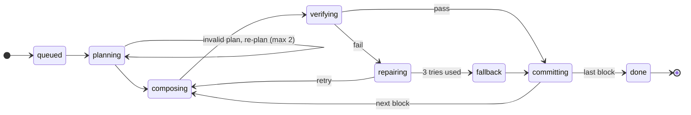

# Circuit Forge — Low-Level Design

## 1. Scope and performance budgets

v1 is a schematic-first circuit tutor for analog fundamentals. The AI composes circuits from verified blocks and streams them as ops; the browser lays them out, animates them and simulates them with ngspice-WASM; a tutor answers questions grounded in live simulation values. Backend is Python (FastAPI); circuit rules live in one Rust crate (`circuit-core`) shared by browser and server.

**In scope (v1):** schematic view, op protocol, plan → compose → verify generation, click-to-ask, user editing with undo/redo, browser simulation (OP, DC sweep, AC, transient), \~150 parts, \~60 verified block templates, accounts and saved projects.

**Out of scope (v1):** breadboard view (v2), microcontroller/firmware simulation, PCB layout, multiplayer, open-ended “discovery” mode.

**Hard limits (v1):** 300 parts, 8 blocks, 400 nets per circuit; 2 s server simulation timeout; 3 repair attempts per block.

| Metric | Target (p95) |
| --- | --- |
| First narration token after Generate | < 1.5 s |
| First committed block on screen | < 6 s |
| Full 4-block circuit committed | < 25 s |
| Local op validation (circuit-core WASM) | < 1 ms |
| Re-simulation after an edit (≤ 50 parts) | < 150 ms |
| Ask: first answer token | < 1.2 s |
| Schematic pan/zoom at 300 parts | 60 fps |
| Token budget per generated circuit | ≤ 40k input + 6k output |
| API process memory per pod | < 512 MB |

## 2. Repository and module layout

One monorepo, three languages, one source of truth: the Rust crate `circuit-core` defines every type on the wire, and everything else is generated from it or calls into it.

```text
circuit-tutor/
├─ crates/
│  ├─ circuit-core/          # IR, ops, apply(), ERC, SPICE compiler — pure, no I/O
│  ├─ circuit-core-wasm/     # wasm-bindgen facade → npm package @tutor/core
│  └─ circuit-core-py/       # PyO3 facade → wheel `circuit_core` (maturin)
├─ contract/schema/          # JSON Schema exported by schemars (generated, committed)
├─ apps/
│  ├─ web/src/               # React + Vite client
│  │  ├─ store/              # circuitStore, opLog, selection, history
│  │  ├─ stream/             # SSE client, NDJSON line parser
│  │  ├─ anim/               # AnimationDirector (GSAP timeline)
│  │  ├─ views/schematic/    # SVG renderer, hit-testing, overlays
│  │  ├─ workers/            # layout.worker.ts (ELK.js), sim.worker.ts (ngspice WASM)
│  │  ├─ tutor/              # ContextBuilder, AskPanel
│  │  └─ gen/                # generated TS types (do not edit)
│  └─ api/tutor_api/         # Python FastAPI service
│     ├─ main.py             # app factory, lifespan, routers
│     ├─ routers/            # generate.py, jobs.py, ask.py, projects.py, registry.py
│     ├─ orchestrator/       # job.py, planner.py, composer.py, verifier.py, repair.py
│     ├─ tutor/              # context.py, service.py
│     ├─ llm/                # gateway.py, providers/, prompts/*.jinja
│     ├─ sim/                # client.py (enqueue + await result)
│     ├─ retrieval/          # parts.py, templates.py (pgvector)
│     ├─ db/                 # SQLAlchemy models, Alembic migrations
│     └─ models/             # generated Pydantic v2 models (do not edit)
├─ workers/sim_runner/       # arq worker: ngspice subprocess runner
├─ registry/                 # parts/*.yaml, symbols/*.svg, models/*.lib, templates/*.yaml
├─ third_party/ngspice/      # pinned source + Emscripten build script
└─ evals/                    # prompts.yaml, run_evals.py, golden/
```

| Deployable | Runtime | Scaling | State |
| --- | --- | --- | --- |
| `web` | Static bundle on CDN | CDN | None (IndexedDB in browser) |
| `api` | FastAPI on Uvicorn, 1 process per container | Horizontal, by open SSE streams | Stateless; job state in Redis + Postgres |
| `sim_runner` | arq worker + ngspice binary | Horizontal, by queue depth | None |
| `registry` | Versioned bundle on CDN | CDN | Immutable per version |
| Postgres 16 + pgvector | Managed | Vertical, read replica later | Users, projects, op logs, templates |
| Redis 7 | Managed | Single primary | Queues, job events, rate limits, caches |

**Dependency rules (enforced in CI):**

- `circuit-core` has no I/O, no clock, no randomness: same input, same output, on every runtime.
- The API never mutates IR by hand; every change goes through `circuit_core.apply(ir, op)`.
- Generated code (`apps/web/src/gen`, `apps/api/tutor_api/models`) is regenerated in CI and the build fails on any diff.
- ngspice version is pinned once and used for both the WASM build and the `sim_runner` image.

## 3. circuit-core: the Circuit IR

The IR is a pure netlist with semantics and no geometry. Positions are computed by the layout engine; the only stored coordinate is `pinned`, which only a user drag can set.

```rust
// crates/circuit-core/src/ir.rs
pub type PartId = String;   // registry id, e.g. "opamp_tl072"
pub type RefDes = String;   // instance id, e.g. "U1", "R3"
pub type NetId = String;    // "N_VOUT"; "GND" is reserved
pub type BlockId = String;  // "b2"

#[derive(Serialize, Deserialize, JsonSchema, Clone, Debug)]
pub struct Circuit {
    pub schema_version: u16,          // 1
    pub registry_version: String,     // "2025.06.0" — fixes symbols, pin maps, models
    pub rev: u64,                     // +1 per applied op
    pub parts: IndexMap<RefDes, PartInstance>,
    pub nets: IndexMap<NetId, Net>,
    pub blocks: IndexMap<BlockId, Block>,
    pub analyses: Vec<Analysis>,
    pub hints: Vec<LayoutHint>,
}

pub struct PartInstance {
    pub refdes: RefDes,
    pub part: PartId,
    pub params: BTreeMap<String, Quantity>, // "resistance" -> 10kΩ
    pub block: Option<BlockId>,
    pub origin: Origin,                     // Llm { job_id } | User | Template { id }
    pub pinned: Option<Placement>,          // user drag only
}

pub struct Quantity { pub si: f64, pub unit: Unit, pub display: String } // parsed from "10k"

pub struct Net {
    pub id: NetId,
    pub pins: BTreeSet<PinRef>,             // serialized as "R3.1", "U1.OUT_A"
    pub kind: NetKind,                      // Signal | Power { volts } | Ground
    pub label: Option<String>,
}

pub struct Block {
    pub id: BlockId,
    pub role: BlockRole,                    // Supply | Source | Amplifier | Filter | ...
    pub title: String,
    pub spec: BTreeMap<String, SpecTarget>, // "fc_hz": { target: 1000, tol_pct: 10 }
    pub ports: Vec<BlockPort>,              // named interface nets: "in", "out", "vcc"
    pub status: BlockStatus,                // Planned | Composing | Verified | Committed | Failed
    pub template: Option<String>,
}

pub enum Analysis {
    Op,
    Dc { source: RefDes, start: f64, stop: f64, step: f64 },
    Ac { points_per_decade: u32, f_start: f64, f_stop: f64 },
    Tran { t_step: f64, t_stop: f64 },
}

pub enum LayoutHint { Flow(Direction), Near(RefDes, RefDes), Group(BlockId) }
```

**Invariants checked by `apply()` on every op:**

1. Every `PinRef` names an existing part and a pin that exists in that part’s registry pin map.
2. A pin belongs to at most one net; connecting it elsewhere is an explicit `net.move_pin`.
3. Exactly one ground net, `GND`.
4. `refdes` is unique and its prefix matches the part category (R, C, L, D, Q, U, V, J).
5. Every param is declared in the part’s registry param schema and within its `min`/`max`.
6. Values arrive as strings (`"4.7u"`, `"2.2meg"`); only circuit-core parses units, so the browser and server never disagree.

## 4. Op protocol

Every change to a circuit, by the LLM or the user, is one op with the same envelope, applied by the same `apply()` function. The circuit is the fold of its op log.

```json
{"v":1, "seq":42, "op":"part.add", "author":"llm", "job":"j_8f2", "block":"b2", "base_rev":17,
 "body":{"refdes":"R3", "part":"resistor_th", "params":{"resistance":"10k"}}}
```

| Op | Body | Inverse (undo) | Who emits |
| --- | --- | --- | --- |
| `block.begin` | id, role, title, spec, ports | `block.remove` | LLM |
| `block.commit` | id | status back to Verified | LLM |
| `block.abort` | id, reason | — (block discarded client-side) | LLM |
| `part.add` | refdes, part, params, block? | `part.remove` | LLM, user |
| `part.remove` | refdes | `part.add` + its `net.connect`s | LLM repair, user |
| `part.set_param` | refdes, key, value | `part.set_param` (old value) | LLM, user |
| `part.swap` | refdes, part (pins remapped by name) | `part.swap` (old part) | user |
| `net.connect` | net, pins\[\], kind? | `net.disconnect` | LLM, user |
| `net.disconnect` | net, pins\[\] | `net.connect` | LLM repair, user |
| `net.rename` | from, to | `net.rename` (reversed) | user |
| `part.pin` | refdes, placement or null | previous placement | user |
| `analysis.set` | analyses\[\] | previous analyses | LLM, user |
| `hint.add` | hint | `hint.remove` | LLM |
| `narrate` | refs\[\], text, block? | — (not an IR change) | LLM |

**Apply semantics:**

- `apply(circuit, op) -> Result<(Circuit, InverseOp), OpError>` is atomic: an op lands whole or not at all, and returns its inverse for undo.
- Ops between `block.begin` and `block.commit` form one transaction: one undo step removes the whole block.
- `narrate` ops never touch the IR. They go to a lesson track keyed by block, so any lesson can be replayed with its narration.
- **v1 is single-writer.** While a generation job streams, the editor is read-only (selection and Ask still work). This removes all merge logic; Yjs-based concurrent editing is a v2 change.
- `base_rev` must equal `circuit.rev`; otherwise the op is rejected with `stale_rev` and the client resyncs from the server snapshot.
- Versioning: the server accepts envelope `v` and `v-1`. Within a major version, changes are additive only; an unknown op is rejected, never ignored.

**Error codes** (returned to the LLM verbatim during repair, shown to users as friendly text): `part_not_in_registry`, `pin_not_found`, `pin_already_connected`, `param_out_of_range`, `refdes_conflict`, `block_not_open`, `stale_rev`, `unknown_op`, `limit_exceeded`.

## 5. Wire protocol: REST and SSE

REST for commands and snapshots, Server-Sent Events for anything streamed. Every streamed event is persisted in a Redis Stream first, so a dropped connection resumes with `Last-Event-ID` and loses nothing.

| Method | Path | Purpose | Returns |
| --- | --- | --- | --- |
| POST | `/v1/projects` | Create a project | Project |
| GET | `/v1/projects/{id}` | Snapshot: circuit, rev, lesson track | Snapshot |
| POST | `/v1/projects/{id}/ops` | Append user ops `{base_rev, ops[]}` | `{rev}` or 409 `stale_rev` |
| POST | `/v1/projects/{id}/generate` | Start a job `{prompt, mode, level}` | 202 `{job_id}` |
| GET | `/v1/jobs/{job_id}/events` | Job event stream, resumable | `text/event-stream` |
| POST | `/v1/jobs/{job_id}/cancel` | Cancel a running job | 202 |
| POST | `/v1/projects/{id}/ask` | Tutor question, answer streamed | `text/event-stream` |
| GET | `/v1/registry/{version}/manifest` | Registry manifest (CDN redirect) | 302 |
| GET | `/v1/me/usage` | Remaining generation quota | Usage |

**SSE event types on `/jobs/{id}/events`:**

| Event | Data | Client action |
| --- | --- | --- |
| `job.state` | state, block? | Update progress UI |
| `narration.delta` | block?, text | Append to narration panel |
| `block.ghost` | id, title, role, ports | Draw a dashed placeholder |
| `op` | one op envelope | Validate locally, enqueue to AnimationDirector |
| `block.repair` | id, attempt, error codes | Show “fixing a wiring issue…” |
| `sim.summary` | block, checks\[{name, target, measured, pass}\] | Show spec badge on block |
| `error` | code, message, retryable | Toast; offer retry if retryable |
| `done` | rev, usage{in\_tokens, out\_tokens} | Unlock editor |
| `heartbeat` | — (every 15 s) | Reset stall timer |

```text
id: 57
event: op
data: {"v":1,"seq":57,"op":"net.connect","author":"llm","block":"b2","base_rev":31,"body":{"net":"N_FB","pins":["U1.OUT_A","U1.INM_A"]}}
```

**Transport details:**

- The client uses `fetch` with a streaming reader (e.g. `@microsoft/fetch-event-source`), not `EventSource`, so it can send the `Authorization` header and POST bodies.
- Events go to Redis Stream `job:{id}:events` (`XADD`, `MAXLEN ~5000`, 1 h TTL). The SSE handler reads with `XREAD BLOCK`, so any API pod can serve any reconnect.
- v1 runs the orchestrator as an asyncio task in the pod that accepted `/generate`. It writes a heartbeat key every 5 s; a reaper marks jobs `failed` after 30 s of silence, and the client offers a retry.
- Ask requests carry `{selection, question, rev, sim_values}`. The server rebuilds the circuit subgraph from its own snapshot at `rev` rather than trusting a client-sent netlist; sim values are taken from the client because the server never simulated the edited circuit.

As built (types, `circuit_core::wire`): the REST bodies and the job events are Rust types in circuit-core, generated into TS and Pydantic like every other wire type. `JobEvent` is `{event, data}` (`{"event":"job.state","data":{"state":"planning"}}`); the SSE writer sends `event` as the event name, `data` as its JSON and the event's sequence number as `id`. Additions: `ProjectSnapshot.active_job` (a reloaded editor stays read-only while a job runs), `GenerateRequest.mode` (`compose`, or `templates`: every block a template at targets, the spend breaker's mode), `LearnerLevel`, and `AnonymousSession` (a signed token per anonymous user until Phase 4 auth), and `ApiError {code, message, retryable}` for every error body and the `error` event.

## 6. Generation orchestrator

A job plans once, then composes and verifies one block at a time; only verified blocks are streamed as ops. The LLM never does arithmetic: component values come from template solvers in Python, snapped to E-series.

**Generation job: 8 states.** Only blocks that pass verification are committed.



| State | What happens |
| --- | --- |
| `queued` | Job accepted |
| `planning` | LLM → `BlockPlan` |
| `composing` | LLM drafts one block |
| `verifying` | circuit-core, ERC, ngspice |
| `repairing` | Errors go back into the prompt |
| `fallback` | Nearest verified template |
| `committing` | Ops → SSE stream |
| `done` | Editor unlocked |

Any state can also end in `failed` (timeouts, provider outage after fallbacks, lost pod) or `cancelled` (`/cancel`); both discard uncommitted ghosts on the client.

```python
# apps/api/tutor_api/orchestrator/job.py
async def run_job(job: Job) -> None:
    ctx = await JobContext.load(job)                 # snapshot, registry version, learner level
    await ctx.set_state("planning")
    cands = await retrieval.search(job.prompt, k_templates=8, k_parts=40)
    plan = await planner.plan(job.prompt, cands, ctx)          # -> BlockPlan (structured output)
    plan = await repair.until_valid(plan, validate_plan, max_tries=2)
    ctx.spawn(narrator.stream(plan))                 # small model, runs concurrently

    for spec in plan.blocks_in_signal_order():
        await ctx.emit("block.ghost", spec.ghost())
        block = await compose_verified(spec, ctx)
        if block is None:                            # 3 failed attempts
            block = templates.nearest(spec).instantiate(spec)  # verified fallback
            await ctx.note(f"Used the standard {block.title} for this stage.")
        await ctx.commit(block)                      # emits block.begin, ops..., block.commit
    await ctx.set_state("done")

async def compose_verified(spec: BlockSpec, ctx: JobContext) -> Block | None:
    errors: list[Issue] = []
    for attempt in range(3):
        draft = await composer.compose(spec, ctx.circuit_text(), errors)
        ops = draft.to_ops(templates)                # template choice -> solver computes values
        trial = circuit_core.apply_all(ctx.circuit, ops)       # PyO3, releases the GIL
        errors = trial.errors + circuit_core.erc(trial.circuit, scope=spec.id)
        if not errors:
            res = await sim.check(trial.circuit, spec)          # enqueued to sim_runner
            errors = res.failed_checks
        if not errors:
            return trial.block
        await ctx.emit("block.repair", {"id": spec.id, "attempt": attempt + 1,
                                        "errors": [e.code for e in errors]})
    return None
```

**Planner output (`BlockPlan`, Pydantic, sent as the structured-output schema):** `blocks[]` with `id`, `role`, `title`, `ports[]` (name, direction, kind), `spec` targets with tolerances, optional `template_hint`; `links[]` such as `b1.out → b2.in`; `analyses[]`. No parts, no values.

**Composer output:** either `{"use_template": "sallen_key_lp", "targets": {"fc_hz": 1000, "q": 0.707}}`, or explicit `parts[]` + `connections[]`. The schema is built per call: `part` is an enum of the ≤ 40 retrieved candidates for that block’s role. Pin names are not enumerable in JSON Schema across parts, so they are given in the prompt and checked by circuit-core, which returns `pin_not_found` for repair.

**Prompt layout (cache-friendly, stable prefix first):**

1. System prompt: role, op rules, output schema — cached.
2. Registry excerpt for the candidate parts, one line each (`opamp_tl072: OUT_A INM_A INP_A VEE INP_B INM_B OUT_B VCC`) — cached per registry version.
3. Plan and this block’s spec.
4. Current circuit as compact netlist text, not JSON (`U1 opamp_tl072 [b2] OUT_A:N_OUT INM_A:N_FB …`) — roughly 4× fewer tokens.
5. Previous attempt’s error codes with the offending ops, on repair only.

**Model routing:** planner and composer use the large model; plan narration, intent routing and Ask use the small model.

**Timeouts and cancellation:** 30 s per LLM call, 120 s per job, 2 s per simulation. `/cancel` cancels the asyncio task; the client discards uncommitted ghosts.

As built (core side, `circuit_core::template::draft`):

- Every planned block names a **reference template**: its ports, rails and spec checks are what the block must meet, and it is the fallback. Checks are a closed set defined per template (§7, as built), so a block composed from nothing would have nothing to be verified against. A plan block no template covers is a plan error (re-plan). The block's `template` field records the reference; each part's `origin` still says who built it.
- The composer's explicit output is a `DraftBlock`, in the shape of a template's `parts` and `nets`: refs are the draft's own (`R1`, `U1`), nets named after the reference template's ports bind to them, `gnd` is ground, other names are internal (`B2_N_A`). `BlockRequest` is either `{template: InsertBlock}` (the composer's `use_template`, the fallback) or `{draft: DraftBlock}`.
- `trial_block(request, job)` (PyO3 `Session.trial_block`) never fails; it returns `BlockTrial {block, author, ops, refdes, spec, problems, warnings, bench}`. It gathers every problem in one pass, each `{code, message, at}` with `at` the draft line (`part R2`, `net out`, `block`): (1) the draft itself (unknown part, a ref that does not match the part's category, an undeclared ref, a pin the part does not have, listing the pins it does have, a pin on two nets, a port with no net); (2) the block alone in an empty circuit, built with the draft's own refs so every message names what the model wrote: every op `apply()` rejects (a refused `part.add` has its pins taken out of the net ops and the batch is re-tried, so a value out of range is one problem, not one per net), then `llm_block` ERC scoped to the block inside its verification bench; (3) the same ops, renumbered, against the job's circuit. With no problems, `bench` is the compiled deck (editor's analyses, the block's checks as `.meas`) that `sim_runner` simulates.
- Deviation (where ERC runs): an LLM block's ERC runs in its template's verification bench (`template::bench_ops`: a sine on each input, a load on each output), not on the block as it sits in the job's circuit. Measured: inserted alone, 15 of the 20 verified templates fail `llm_block` ERC (ERC002/003 on their open input or output ports); in their benches, 0 of 100 verification points do. The same bench verifies templates in CI (`tools/sim` and the Rust test now build it with `bench_ops`), and the Rust test asserts that `trial_block` of every template at every point produces the same ops and the same bench netlist hash as CI's. Cost: interactions between blocks (one block loading another) are not verified on the server; the browser simulates the whole circuit live after every commit, and the plan validator checks that links join outputs to inputs.
- Deviation (values): in a draft the model writes part values, against "the LLM never does arithmetic". Values are parsed and range-checked by `apply()`, and wrong ones fail the spec checks, which go back to the composer as `spec_miss` with the measured value. The template path keeps every value solver-computed.
- `trial_block` is in the PyO3 build only: in WASM it added 23 KB gzip to `core_bg.wasm` (386 → 409 KB) for a call the browser never makes; `benchOps` alone adds 2 KB (388 KB). New error code `compile_failed` (the compiler refused a circuit `apply()` accepted).

## 7. Validation and ERC rules

Validation has three layers: structural invariants (section 3) are always enforced; static ERC runs on the graph in under 1 ms; post-sim ERC and spec checks need simulation results. LLM blocks must pass all three to commit. User circuits only need the first: a learner is allowed to build a broken circuit, and the ERC findings become tutor prompts.

| Rule | Check | Phase | Code | LLM block | User edit |
| --- | --- | --- | --- | --- | --- |
| ERC001 | Pin not on any net (except registry `nc` pins) | Static | `floating_pin` | Reject | Warn |
| ERC002 | Net with fewer than 2 pins | Static | `dangling_net` | Reject | Warn |
| ERC003 | Node with no DC path to GND (union-find over R, L, V, D, Q, op-amp branches) | Static | `no_dc_path` | Reject | Warn + auto 1 GΩ shunt for sim |
| ERC004 | Loop of ideal voltage sources or inductors | Static | `vsource_loop` | Reject | Block sim, explain |
| ERC005 | IC power pin not on a Power net | Static | `unpowered_ic` | Reject | Warn |
| ERC006 | Two output-type pins on one net | Static | `output_conflict` | Reject | Warn |
| ERC007 | Power net tied to GND, or two supplies of different voltage merged | Static | `supply_short` | Reject | Warn |
| ERC008 | Supply voltage above part’s registry `v_max` | Static | `over_voltage` | Reject | Warn |
| ERC009 | Block port not bound to its declared net | Static | `port_unbound` | Reject | — |
| ERC010 | Unused half of a multi-unit IC left floating | Static | `unused_unit` | Warn | Info |
| ERC011 | Polarized capacitor reverse-biased at operating point | Post-sim | `reverse_polarity` | Reject | Warn |
| ERC012 | Part dissipation above rating (P = V·I at OP) | Post-sim | `over_power` | Reject | Warn + “smoke” overlay |
| ERC013 | Diode/LED current above `i_max` | Post-sim | `over_current` | Reject | Warn + “smoke” overlay |
| ERC014 | Op-amp output within 0.5 V of a rail at OP (saturated) | Post-sim | `saturated` | Reject unless role allows | Info |

**Spec checks per block role** (generated as ngspice `.meas` statements by the compiler):

| Role | Measured | Analysis |
| --- | --- | --- |
| Amplifier | Mid-band gain (dB), input/output bias within window, no clipping at rated swing | OP, AC, Tran |
| Filter | f c (−3 dB point), Q or pass-band ripple, stop-band attenuation at 10·f c | AC |
| Oscillator / 555 | Frequency and duty cycle after start-up, amplitude | Tran |
| Supply / regulator | Output voltage under load, dropout headroom | OP, DC sweep |
| Comparator / Schmitt | Thresholds and hysteresis | DC sweep |
| Source / bias | Node voltages within window | OP |

Each check returns `{name, target, measured, tol_pct, pass}`. Failures go back to the composer as `spec_miss` with the measured value, e.g. `fc_hz target 1000 ±10%, measured 1590`.

As built (spec checks, `circuit_core::template::checks`):

- A check is one of a closed set of kinds, so a template can never inject SPICE: `ac_corner` (−3 dB below the pass band), `ac_q` (2nd-order Q: |H(f0)| over the pass band, f0 at the ∓90° phase point), `ac_gain` (|V(out)|/|V(in)| at a frequency), `ac_center` and `ac_band_q` (band-pass centre √(f_lo·f_hi) and f0/(f_hi − f_lo)), `tran_freq`, `tran_duty`, `tran_amplitude`, `dc_level`, `tran_threshold`. A template's checks name its ports; the block's `spec` holds each target and tolerance.
- The compiler emits primitive `.meas` cards on the port nets (`<block>_<check>_<part>`, e.g. `b3_fc_hz_ref`), and `evaluate_checks` (both bindings) combines their results: ngspice 47 measures single vectors only and rejects `vdb(out)-vdb(in)`. Levels for crossings are relative (`(hi+lo)/2`, `ref-3`), so they hold at any supply. Each result is `{block, name, label, symbol, unit, target, measured, tol_pct, pass, target_display, measured_display, note}`, formatted by the core.
- A check whose analysis is not in the deck, whose port net is gone, or which needs a signal when the circuit has no periodic source, is listed with a reason (`needs a signal: connect a sine source to the block's input`) instead of a wrong number.
- Deviation (OP checks): supply, bias and source levels are `dc_level`, the average over the transient the editor always runs: ngspice `.meas` has no OP mode. The regulator's "dropout headroom" check is not built (a DC sweep needs a source the block does not own).
- Deviation (comparators): thresholds are measured in the transient on a sine input (the input level at the 2nd rising or falling output edge), not with a DC sweep: one sweep runs one way, so it cannot show hysteresis, and the driving source is outside the block.
- Regenerative circuits need fine steps. With 100 µs steps the implicit integrator follows a Schmitt trigger's unstable balance point until it hits a rail: the LM358 Schmitt switched up to 2.6 V late; with 2 µs steps it is within 1% (ngspice caps its internal step at the `.tran` step). A check may declare the transient it needs (`tran: {stop: 20m, step: 2u}`); inserting the block sets it, and a coarser transient reports "needs transient steps of at most 2µs". Measured in Edge: a Schmitt trigger and its source, edit to new result 224–242 ms (ngspice 64–77 ms for 10,000 steps), against 173–180 ms for the demo.
- Oscillators are measured in the second half of a 16-period transient (two periods between rising mid-level crossings): leaving a poor operating point took a 555 up to 5 periods.
- `ac_q` assumes the block's input is driven with flat phase (a source or a buffer), as in the template's bench.

## 8. SPICE compiler and simulation

One compiler in circuit-core produces byte-identical netlists in the browser and on the server; the same pinned ngspice runs in both places. The netlist hash is the cache key for every simulation result.

```rust
// crates/circuit-core/src/spice.rs
pub struct Netlist {
    pub text: String,                    // deterministic: parts sorted by refdes
    pub hash: [u8; 32],                  // sha256(text) -> cache key
    pub node_map: BTreeMap<NetId, String>, // "N_VOUT" <-> "n_vout", "GND" <-> "0"
    pub includes: Vec<ModelRef>,         // model files the sim must load
    pub meas: Vec<MeasDef>,              // spec checks as .meas statements
}
pub fn compile(c: &Circuit, reg: &Registry, opts: &CompileOpts) -> Result<Netlist, CompileError>;
```

**Compiler rules:**

- Each registry part has a SPICE template, e.g. `R{refdes} {1} {2} {resistance}` or `X{refdes}_A {INP_A} {INM_A} {VCC} {VEE} {OUT_A} TL072`; multi-unit ICs emit one subcircuit call per unit.
- `GND` maps to node `0`; other nets are sanitized to lowercase and kept in `node_map` so results map back to the IR.
- `.include` lines are de-duplicated; model files ship inside the registry bundle.
- Defaults: `.options reltol=1e-3 gmin=1e-12`; `.save` all node voltages plus the branch currents needed for overlays.
- User circuits that fail ERC003 get a temporary 1 GΩ shunt to ground in the compiled netlist only, so the simulation still runs and the tutor can explain the problem.
- As built (supply rails): a power net that no voltage source and no IC output pin drives is simulated as an ideal source at its declared volts (`Vrail_vcc vcc 0 DC 1.2e1`), and ERC treats its flag as that connection (no ERC003, and one pin on it is not ERC002). A rail drawn with the rail tool, or created by inserting a block, therefore powers what is on it; before, it powered nothing until a DC source was also wired to it, which stopped first-year students. A regulator's output rail (driven by the IC's output pin) and rails with their own source are left alone.
- As built (checks): `Netlist.meas` holds the spec checks' `.meas` cards, after the analysis cards; `Netlist.checks` says which results each check combines (§7, as built).

**Browser: Sim Worker**

```ts
// apps/web/src/workers/sim.worker.ts — exposed via Comlink
interface SimApi {
  init(registryVersion: string): Promise<void>;      // loads ngspice.wasm + model files into MEMFS
  run(req: { netlist: string; hash: string; analyses: Analysis[] }): Promise<SimResult>;
}
interface SimResult {
  hash: string;
  vectors: {
    name: string;                         // canonical: v(n_out), i(v1), @r1[i], time, frequency, v-sweep
    analysis: "op" | "dc" | "ac" | "tran"; // one plot per analysis; v(n_out) exists in each
    unit: "V" | "A" | "Hz" | "s";
    data: Float64Array;                   // transferred, not copied; real part
    imag?: Float64Array;                  // complex (AC) vectors
  }[];
  meas: Record<string, number>;           // a failed measurement is absent
  status: "ok" | "no_convergence" | "singular_matrix" | "timeout" | "error"; // error: deck rejected
  log: string;
  ms: number;
}
```

- `.meas` cards stay in the netlist (so the hash covers them), but both drivers lift them out and replay them after `run` as interactive `meas` commands against the plot of their own analysis: ngspice 47 evaluates deck `.meas` cards only for the last analysis that ran, and not at all with `-b -r`. Vectors inside model subcircuits are never returned.

- ngspice is built with Emscripten in shared-library mode (`ngSpice_Init`, `ngSpice_Circ`, `ngSpice_Command`, `ngGet_Vec_Info`). It runs synchronously inside the worker, so no pthreads and no COOP/COEP headers are needed.
- The WASM file is lazy-loaded after first paint and cached by the service worker.
- Scheduling is latest-wins: edits are debounced 150 ms, and a result whose hash no longer matches the store is discarded. A watchdog terminates and respawns the worker if a run exceeds 2 s.
- Interactive default is OP plus a short transient; AC and long transients run only when the scope panel asks for them.
- Traces are downsampled with LTTB to at most 2,000 points before plotting. Current-flow dot speed is proportional to log |I|.
- As built (interactive set): the core decides what runs (`CompileOpts.interactive`, `interactive_analyses`): OP; the circuit's own `.tran`, or else a short default one, five periods of the slowest periodic source (a hertz-valued parameter of a voltage source) or 10 ms without one, in 1,000 steps; then any AC or DC sweep the circuit holds. The scope asks for an AC sweep or a longer transient with `analysis.set`, so a request is undoable, saved with the circuit and settable by the LLM, and what runs depends on the IR alone (the same netlist hash on the server). `Netlist.analyses` reports the resolved set. Measured in Edge on the demo (OP, 5 ms transient, AC 10 Hz–100 kHz at 20 points/decade): ngspice 11–16 ms, edit to new result 170–185 ms, of which 150 ms is the debounce. A 300-part RC ladder: ngspice 47–73 ms, edit to new result 262 ms.
- As built (currents): `Netlist.pin_currents` maps each connected pin of a primitive device to the saved vectors giving the current into it (`R1.1` → `+@r1[i]`, `R1.2` → `−@r1[i]`, `V1.P` → `+i(v1)`, `Q1.E` → `−@q1[ic] − @q1[ib]`), from SPICE's fixed terminal order. Pins inside subcircuit models (op-amps, regulators, the 555) have none; the client fills a net's one unknown pin by KCL. Device currents exist in the OP and transient plots, not in AC.
- As built (LTTB): the traces of one plot share an x axis, so one set of indices is chosen for all of them: per bucket, the point with the largest triangle area summed over the traces, each normalised by its own range (a 1 mV glitch survives next to a 12 V trace).
- ngspice log lines such as “timestep too small” or “singular matrix” map to status codes the tutor can explain.

**Server: `sim_runner` (arq worker)**

- Task `simulate(netlist, meas, timeout_s=2)` runs `ngspice -b` as a subprocess in a per-job tmpfs directory, with `RLIMIT_AS` 256 MB and `RLIMIT_CPU` 2 s, and is killed on timeout. The container has no network access.
- `.meas` results are parsed from stdout into `{name, measured}`; the API compares them with spec targets.
- Results are cached in Redis as `sim:{hash}` for 24 h. Template-based blocks repeat often, so most verification runs hit the cache.
- One worker process per CPU core; small circuits take roughly 20–200 ms, so 4 cores verify on the order of 50 blocks per second.

As built (`workers/sim_runner`):

- One driver: `sim_runner.ngspice_batch` (moved from `tools/sim`, which imports it). The task takes `{netlist, includes, hash, registry_version, timeout_s}` (a compiled `Netlist`, e.g. `BlockTrial.bench`) and returns `{ok: {hash, status, meas, failed_meas, log, ms, cached}}` or `{err: {code, message}}`; `log` is the last 4,000 characters. `sim_runner.client.simulate` is what the API calls. Jobs and results are JSON, not arq's default pickle (anything that can write to Redis could otherwise run code in the worker).
- No vectors on the server: it needs only `.meas` values and the status. Measured on the 100 template benches: their vectors are 330 KB of JSON at the median and 2.3 MB at most (Schmitt), and parsing them took up to 99 ms of CPU per run. The worker reads only each rawfile's header, to detect an analysis that did not run.
- Deviation (cache key): `sim:{registry_version}:{hash}`, not `sim:{hash}`: the netlist names its model files but does not contain them, and a registry bump may change them. The worker recomputes the sha256 and refuses a mismatch (`hash_mismatch`), a request for another registry version (`registry_mismatch`), an include outside the registry or an `.include` card not in `includes` (`include_invalid`), and netlists over 1 MB. Timeouts are not cached (they depend on load). The arq job id is the cache key, so identical requests in flight run ngspice once (tested: six at once, one run). Both sides poll every 20 ms (arq's default 0.5 s would add up to a second per run).
- Deviation (processes): one asyncio worker process runs up to `SIM_CONCURRENCY` (default: one per core) ngspice subprocesses at once, each waited on from a thread, instead of a worker process per core; without vector parsing, the Python side of a run is writing the deck and reading `.meas` lines. Measured in the image (Linux, source-built ngspice 47, production limits): the 100 benches take 6 ms at the median, 66 ms at p95 and 76 ms at most (LED flasher); peak ngspice RSS 22 MB; with 4 CPUs, 234 benches per second. Through compose from the host: 37–95 ms per simulation on a miss (10–69 ms of it ngspice), under 1 ms on a cache hit.
- Sandbox: `RLIMIT_AS` 256 MB and `RLIMIT_CPU` ⌈timeout⌉ s are set by `sh -c 'ulimit -v … && ulimit -t … && exec ngspice …'` (`preexec_fn` is unsafe in a process with threads); a run killed by `RLIMIT_CPU` is a `timeout`. Each run's deck directory is in a tmpfs at `/tmp`: it has to be `/tmp`, since ngspice calls `tmpfile()`, which ignores `TMPDIR` (a read-only `/tmp` failed every run). The container is read-only, non-root (uid 10001), with all capabilities dropped, `no-new-privileges` and a pids limit.
- Deviation (network): the worker is on an internal compose network with Redis only, instead of no network, since it has to reach Redis. Checked from inside: no route to an outside address and no DNS; Redis reachable.
- Image: `workers/sim_runner/Dockerfile` builds ngspice from the pinned source with `build-native.sh` (the CI engine) in a builder stage; `SPICE_LIB_DIR` points the moved binary at its `spinit`. 209 MB. CI builds it, runs `python -m sim_runner.selftest` (a Sallen-Key bench whose recorded `.meas` values must match within 2%; a test keeps its netlist equal to what circuit-core compiles) under the production flags, and starts the worker with compose until its arq health check passes. The worker tests run against Redis 7 in testcontainers.

## 9. Tutor service and context builder

The tutor answers from a small, local slice of the circuit plus real simulation numbers, never the whole circuit. Every claim it makes must point at something in that slice, and every edit it suggests is a normal op the learner can test.

**Context, as sent to the model (compact text, ≤ 2k tokens):**

```text
LEVEL: beginner (1st-year EE)
BLOCK: b2 "Sallen-Key low-pass" spec fc=1kHz ±10% Q=0.707 | verified fc=1003Hz Q=0.71
SELECTED: R3 resistor 10kΩ, pins 1:N_IN 2:N_A
NEIGHBOURS (1 hop):
  N_IN: J1.SIG R3.1        V=0.00V dc, 1.00V ac
  N_A:  R3.2 R4.1 C1.1     V=0.00V dc, 0.98V ac @100Hz
CURRENTS: I(R3)=12.4µA rms @100Hz
ERC: none
QUESTION: Why is R3 10k and not 1k?
```

**Context builder rules:**

- Part selected → the part, its nets, every pin on those nets, its block’s spec and check results.
- Net selected → all pins on it, its voltage at OP and at the scope’s current frequency or time.
- Block selected → block summary, ports, spec checks, part list without neighbours.
- Refdes mentioned in the question (regex on `R\d+`, `U\d+`…) are added too, up to 15 parts; beyond the budget, parts are dropped by graph distance from the selection.

**Tutor prompt rules:**

1. Cite parts and nets as `[R3]`, `[net:N_A]`, `[block:b2]`; the client turns these into highlights.
2. Use only numbers present in the context, or show the arithmetic that derives them.
3. If the answer needs data that isn’t in the context, say so and suggest a probe or analysis.
4. Match the learner’s level; default to ≤ 150 words; in Socratic mode, ask one guiding question first.
5. To suggest an experiment, end with a fenced `try` block: `{"ops":[…], "predict":"fc drops to about 500 Hz"}`.

**Client handling of answers:**

- References that don’t exist in the circuit render as plain text and are logged as a hallucination metric.
- A `try` block is validated by circuit-core, shown as a card, and applied only on confirm. After re-simulation the UI shows the prediction next to the measured value: predict, then test.
- “What changed?” sends the before/after diff of `.meas` values and node voltages to the small model, not the circuits themselves.

**Caching:** for unedited template circuits, answers are cached by `hash(registry_version, template_id, selected role, normalized question)`, which covers most lesson questions. Edited circuits are never served cached answers.

## 10. Frontend internals

The authoritative circuit lives inside a WASM `CoreSession`; React only ever sees small patches. Ops flow one way: stream or edit tool → core → store patch → layout → animation → simulation.

```ts
// apps/web/src/store/circuitStore.ts (Zustand + Immer)
interface CircuitState {
  rev: number;
  parts: Record<RefDes, PartView>;        // mirrors core, updated by patches only
  nets: Record<NetId, NetView>;
  blocks: Record<BlockId, BlockView>;     // includes status + spec badges
  ghosts: Record<BlockId, Ghost>;
  layout: Layout;                         // see "Layout worker" below
  sim: { hash: string; status: SimStatus; result?: SimResult; voltages: Record<NetId, number> };
  selection: Selection | null;
  mode: "idle" | "generating" | "editing";
  history: { undo: Txn[]; redo: Txn[] };
}
// core.apply(op) -> { patch, inverse } ; patch = { added, removed, changed } by id
// core.changes(patch) -> PatchData: the current parts/nets/blocks the patch names
```

Keeping the IR in WASM memory means a 300-part circuit is never serialized per op; `apply` returns only what changed.

- Addition: `CoreSession.changes(patch)` (both bindings) returns `PatchData`, the current state of just the ids a patch upserted, plus analyses/hints when they changed. The store merges that; the only full read is loading a snapshot.
- Undo/redo: one user action (or `applyBatch`) is one step, recorded as the inverse ops `apply()` returned. Undo applies them through the core, and the inverse *that* returns is the redo step, so history never bypasses `apply()`.
- Ordering: parts and blocks keep the core's insertion order in the mirror; nets do not (`net.rename` keeps its slot in the core but re-inserts in a JS object), so nothing downstream depends on net order: layout sorts nets by id.
- Simulation: a rev change schedules a run after 150 ms; the core compiles with `shunt_floating`; an unchanged netlist hash runs nothing, a result for a stale hash is dropped. The core picks the interactive analyses (§8, as built). Each result is decoded once into `sim.view`: net voltages and pin currents by IR id for OP, transient and AC; nothing downstream parses vector names.

**AnimationDirector**

- Holds a queue of received ops. Each op is applied to the core, patched into the store, laid out, then animated. Network speed and animation speed are decoupled.
- Step animations: `block.begin` pans to the ghost; `part.add` scales in over 300 ms; `net.connect` draws the wire with `stroke-dashoffset` over 400 ms; `narrate` highlights its refs while text appears; `block.commit` turns the outline solid and shows the spec badge.
- Controls: 0.5×–4× speed, pause, skip to end (apply the rest instantly), scrub. Scrubbing replays the op log into a scratch `CoreSession`; 300 ops replay in under 5 ms.
- An op rejected by the local core here means a version skew bug: it is dropped, reported to telemetry, and the client resyncs from the server snapshot.

**Layout worker (two-level, for stability)**

1. Each block is laid out on its own with ELK `layered`, direction RIGHT, orthogonal routing, and `FIXED_POS` port constraints taken from the registry symbol’s pin positions. The result is cached by block content hash.
2. Blocks are then placed as macro-nodes left to right in signal order. Adding a block re-runs only this top level, so earlier blocks don’t jump.
3. Power and ground are not routed as wires; each pin gets a VCC/GND flag symbol, which removes most clutter.
4. Parts with `pinned` placements are fixed nodes; user drags never get overridden.

As built (`apps/web/src/workers/layout.engine.ts`):

- Level 1: the cache key is the block's ELK input graph itself (topology, orientation, footprints), so param edits never re-lay out and there are no hash collisions. Nets leaving a block end at ports on its frame (inputs west, outputs east); a block's declared signal ports always get a frame port, so connecting a downstream block does not invalidate the upstream block's cache.
- Level 2 is deterministic rather than a second ELK run: blocks go left to right in signal order (output port → input port, ties in IR order), each aligned with the port that drives it; wires between adjacent blocks use channels in the gap, wires that skip a block go over the top. ELK `layered` re-run at this level can shift earlier blocks vertically; appending columns cannot, which the tests check.
- Flags and the reference/value labels are part of each symbol's footprint, so ELK keeps wires and other symbols off them. Two-pin parts are turned so supply pins face up and ground/negative pins face down (shunts stand upright). A multi-unit part is drawn once per used unit; shared pins (VCC/VEE) appear, with their flags, on each unit.
- Deviation: ELK `layered` has no absolute-position constraint for single nodes (its interactive strategies only use coordinates as ordering hints), so pinned parts are left out of ELK, placed exactly at `pinned`, and joined to the nearest point of each of their nets with a short orthogonal wire. User drags are never overridden; a pinned part may overlap a laid-out one, which is the user's choice. Pinning a multi-unit part fixes its first unit; further units stack below it.
- ELK runs in its own nested worker (`elk-worker.min.js` via `elk-api`'s `workerFactory`) inside `layout.worker.ts`: the bundled build, loaded inside any worker, takes over `self.onmessage` instead of running in-thread, which would swallow Comlink's messages.
- Output: `{ symbols (per drawn unit, with rot/flip and label spot), wires, junctions, flags, blocks (frames), pins, netLabels, bounds }`. Measured (Node, warm ELK): demo 69 ms uncached / 0.3 ms cached; 300 parts in 8 blocks 293 ms uncached / 4 ms cached.

**Renderer**

- SVG for parts and wires: registry symbols as `<symbol>` defs, instances as memoized `<use>` elements.
- Overlays (voltage colouring, current dots) are drawn on a separate canvas layer with `requestAnimationFrame`, so animating dots never re-renders React.
- Pan/zoom via a single transform matrix (d3-zoom); hit-testing uses native SVG events.

As built (overlays, `views/schematic/overlay.ts`):

- The canvas sits under the SVG: voltage colouring is a halo behind each wire, and the SVG keeps the selection highlight and hit-testing. The colour scale spans the largest |V| on drawn (signal) nets, so a 12 V rail, drawn as a flag, does not wash out a 1 V signal.
- Current along a wire comes from KCL (`flow.ts`): each net's drawn wires are split into edges at vertices, branch points and pins, a spanning tree is taken, and an edge carries the sum of the pin currents beyond it. Two-pin parts also carry their current through the body. Dots move at log10(|I| / 1 nA) · 8 units/s; below 1 nA nothing moves.
- With a transient the overlays play it in a loop, one period of the slowest source per second (2–20 s per loop), and the scope draws a cursor at the same instant; otherwise they show the OP. The last good result stays up while the next one runs.
- The renderer reads the stores with `subscribe`, never through a hook. An e2e test counts React commits through the DevTools hook while the dots move: none. Measured in Edge at 300 parts: 145 fps (the display's rate), p95 frame 7.4 ms.

**Edit tools:** the wire tool snaps only to pins and emits `net.connect`; the place tool lists registry parts; value fields use the core’s unit parser so “4k7” and “4.7k” both work.

As built:

- Gestures become ops in the core (`circuit_core::edit`, both bindings), not in the editor. `next_refdes(part)`: the category letter and the lowest free number (delete R2, place a resistor: R2). `connect(pin, end)`: two free pins make a new net (`N1`, `N2`, …, free of case-insensitive clashes); a free pin joins the other end's net; two nets merge, the lower-ranked net's pins moving to the other with `net.disconnect` + `net.connect`, so undo restores it with its kind and label. Rank: ground, power, a block's port net, labelled, more pins, smaller id. A `rail` end (`{net, kind}`) creates ground or a supply rail on first use; a signal net wired to a new rail becomes that rail; a pin on another supply is refused rather than shorted. Wiring a pin to its own net is refused with `pin_already_connected`.
- Every gesture is one `apply`/`applyBatch`, so one undo step (`store/edits.ts`). Place adds the part unpinned, so the layout positions and routes it. A drag moves the part's `<g>` in the DOM (snapped to the 10-unit grid) and emits `part.pin` on drop; R rotates in place (which pins); Auto-place emits `part.pin null`. The wire and rail tools snap to the nearest `layout.pins` point within 10 screen px. Delete removes a part (`part.remove`) or a whole net (`net.disconnect` of all its pins); the inspector disconnects single pins. Value fields show the core's parse as you type and emit `part.set_param` with the text as typed. ERC (`user_edit`) re-runs after every change and is listed with links to its parts and nets.
- Deviation from the layout rule above ("drawn once per used unit"): a part the user placed (`origin: user`) draws every unit, used or not, so the second half of a dual op-amp can be wired; generated parts still draw used units only, and ERC010 explains a floating unit. Trade-off: one extra symbol per unused unit of a user's part, no extra layout pass.
- The store's `layoutRev` is the rev whose topology the drawing shows; the schematic exposes `data-rev` and `data-layout-rev`, so tests (and later the AnimationDirector) wait for the drawing instead of sleeping.
- While the user has not panned or zoomed, the view fits each new layout (at most 1.5×), so a circuit built from nothing stays in view; Fit resumes this.

**Scope (as built, `views/scope`):** uPlot (canvas, log x axis for Bode plots, about 50 KB) instead of a hand-written plot. Probes are UI state, not IR: voltages on nets, currents into pins; the selected net is always shown as a dashed trace. Transient tab: the auto transient or the circuit's own (at most 100,000 steps from the scope). AC tab: magnitude in dB and unwrapped phase. Both edit the circuit's analyses with `analysis.set`.

**Sync:** user ops are batched every 1 s to `POST /ops`. Offline, they queue in IndexedDB and replay on reconnect; a 409 `stale_rev` triggers a snapshot reload.

## 11. Persistence: Postgres schema

Projects are event-sourced: an append-only `ops` table plus a periodic snapshot. Every generation attempt is stored, failures included, because that table becomes your eval set and future fine-tuning data.

```sql
CREATE TABLE users (
  id uuid PRIMARY KEY, email citext UNIQUE NOT NULL,
  level text NOT NULL DEFAULT 'beginner', plan text NOT NULL DEFAULT 'free',
  created_at timestamptz NOT NULL DEFAULT now()
);

CREATE TABLE projects (
  id uuid PRIMARY KEY, owner_id uuid NOT NULL REFERENCES users(id),
  title text NOT NULL, registry_version text NOT NULL,
  head_rev bigint NOT NULL DEFAULT 0,
  snapshot jsonb, snapshot_rev bigint NOT NULL DEFAULT 0,
  created_at timestamptz NOT NULL DEFAULT now(), updated_at timestamptz NOT NULL DEFAULT now()
);

CREATE TABLE ops (
  project_id uuid NOT NULL REFERENCES projects(id) ON DELETE CASCADE,
  seq bigint NOT NULL, rev_after bigint NOT NULL,
  author text NOT NULL CHECK (author IN ('llm','user','template')),
  job_id uuid, op jsonb NOT NULL, created_at timestamptz NOT NULL DEFAULT now(),
  PRIMARY KEY (project_id, seq)
);

CREATE TABLE lesson_track (
  project_id uuid NOT NULL REFERENCES projects(id) ON DELETE CASCADE,
  seq bigint NOT NULL, block_id text,
  kind text NOT NULL CHECK (kind IN ('narration','note','repair')),
  text text NOT NULL, refs text[] NOT NULL DEFAULT '{}',
  PRIMARY KEY (project_id, seq)
);

CREATE TABLE jobs (
  id uuid PRIMARY KEY, project_id uuid NOT NULL REFERENCES projects(id),
  user_id uuid NOT NULL REFERENCES users(id),
  prompt text NOT NULL, mode text NOT NULL, state text NOT NULL,
  plan jsonb, error_code text, model text,
  in_tokens int NOT NULL DEFAULT 0, out_tokens int NOT NULL DEFAULT 0,
  started_at timestamptz NOT NULL DEFAULT now(), finished_at timestamptz
);
CREATE INDEX jobs_user_recent ON jobs (user_id, started_at DESC);

CREATE TABLE block_attempts (            -- eval + training goldmine
  job_id uuid NOT NULL REFERENCES jobs(id) ON DELETE CASCADE,
  block_id text NOT NULL, attempt smallint NOT NULL,
  ops jsonb NOT NULL, errors jsonb NOT NULL DEFAULT '[]',
  sim_checks jsonb, latency_ms int,
  PRIMARY KEY (job_id, block_id, attempt)
);

CREATE TABLE templates (
  id text NOT NULL, version int NOT NULL, role text NOT NULL,
  title text NOT NULL, description text NOT NULL,
  body jsonb NOT NULL, verified_registry_version text NOT NULL,
  embedding vector(1024),               -- dimension = your embedding model's
  PRIMARY KEY (id, version)
);
CREATE INDEX templates_emb ON templates USING hnsw (embedding vector_cosine_ops);

CREATE TABLE parts (
  id text NOT NULL, registry_version text NOT NULL,
  category text NOT NULL, role_tags text[] NOT NULL,
  description text NOT NULL, meta jsonb NOT NULL,
  embedding vector(1024),
  PRIMARY KEY (id, registry_version)
);
CREATE INDEX parts_emb ON parts USING hnsw (embedding vector_cosine_ops);

CREATE TABLE asks (
  id uuid PRIMARY KEY, project_id uuid NOT NULL REFERENCES projects(id) ON DELETE CASCADE,
  user_id uuid NOT NULL REFERENCES users(id), rev bigint NOT NULL,
  selection jsonb NOT NULL, question text NOT NULL, answer text NOT NULL,
  refs_valid int NOT NULL DEFAULT 0, refs_invalid int NOT NULL DEFAULT 0,
  feedback smallint, created_at timestamptz NOT NULL DEFAULT now()
);

CREATE TABLE usage_daily (
  user_id uuid NOT NULL REFERENCES users(id), day date NOT NULL,
  gen_jobs int NOT NULL DEFAULT 0, asks int NOT NULL DEFAULT 0,
  tokens_in bigint NOT NULL DEFAULT 0, tokens_out bigint NOT NULL DEFAULT 0,
  PRIMARY KEY (user_id, day)
);
```

**Load and write paths:**

- Load = `snapshot` + ops with `seq > snapshot_rev`, folded by circuit-core.
- A new snapshot is written every 200 ops and at the end of every job.
- `POST /ops` inserts the batch and bumps `head_rev` in one transaction with `SELECT … FOR UPDATE` on the project row; a mismatched `base_rev` returns 409.
- Retrieval filters by `role` and `registry_version` first, then ranks by vector similarity.

## 12. Component registry and template library

The registry is the only source of geometry, pin maps and SPICE models; templates are the only way most blocks get built. Both are YAML in git, compiled into an immutable, versioned bundle on the CDN.

**Part definition:**

```yaml
# registry/parts/opamp_tl072.yaml
id: opamp_tl072
category: U
title: TL072 dual JFET op-amp
role_tags: [amplifier, filter, buffer]
units: [A, B]
pins:
  - {name: OUT_A, num: 1, type: output,    unit: A}
  - {name: INM_A, num: 2, type: input,     unit: A}
  - {name: INP_A, num: 3, type: input,     unit: A}
  - {name: VEE,   num: 4, type: power_neg}
  - {name: INP_B, num: 5, type: input,     unit: B}
  - {name: INM_B, num: 6, type: input,     unit: B}
  - {name: OUT_B, num: 7, type: output,    unit: B}
  - {name: VCC,   num: 8, type: power_pos}
limits: {v_supply_max: 36, i_out_max: 0.02}
spice:
  include: models/tl072.lib
  unit_line: "X{refdes}_{unit} {INP} {INM} {VCC} {VEE} {OUT} TL072"
symbol: symbols/opamp.svg           # one unit; pin anchors matched by (base) name
breadboard: bb/dip8.svg             # v2
teach: "JFET inputs draw almost no current; supply up to ±18 V."
```

**Block template with a value solver:**

```yaml
# registry/templates/sallen_key_lp.yaml
id: sallen_key_lp
version: 3
role: filter
title: 2nd-order Sallen-Key low-pass (unity gain)
targets: {fc_hz: {min: 10, max: 50000}, q: {min: 0.5, max: 2.0}}
ports: {in: input, out: output, vcc: power_pos, vee: power_neg, gnd: ground}
parts:
  R1: {part: resistor_th}
  R2: {part: resistor_th}
  C1: {part: cap_film}
  C2: {part: cap_film}
  U1: {part: opamp_tl072, unit: A}
nets:
  in:  [R1.1]
  n_a: [R1.2, R2.1, C1.1]
  n_b: [R2.2, C2.1, U1.INP_A]
  out: [U1.OUT_A, U1.INM_A, C1.2]
  gnd: [C2.2]
  vcc: [U1.VCC]
  vee: [U1.VEE]
solver: solvers.sallen_key_lp
checks:
  - {name: fc_hz, analysis: ac, tol_pct: 10}
  - {name: q,     analysis: ac, tol_pct: 15}
```

```python
# apps/api/tutor_api/orchestrator/solvers.py
def sallen_key_lp(fc_hz: float, q: float) -> dict[str, str]:
    r = 10e3                                   # equal R, unity gain
    c2 = 1 / (2 * math.pi * fc_hz * r * 2 * q) # w0 = 1/(R*sqrt(C1*C2)), Q = 0.5*sqrt(C1/C2)
    c1 = 4 * q * q * c2
    return {"R1": "10k", "R2": "10k", "C1": e_series(c1, "E12"), "C2": e_series(c2, "E12")}
```

**Build and verification pipeline:**

1. CI loads every YAML through circuit-core’s registry loader; unknown pins, missing symbols or bad SPICE lines fail the build.
2. Every template is instantiated at 5 target points spread across its range, simulated, and must pass all its checks. Only then is `verified_registry_version` set.
3. The bundle (parts JSON, SVG sprite sheet, model files) is published as `registry-<version>`; projects pin a version and never change it silently.
4. Licensing: KiCad symbols and Fritzing parts are CC-BY-SA and need attribution; vendor SPICE models each have their own redistribution terms, so record the licence per model file.

**Schematic symbols (as built):**

- `registry/symbols/<id>.svg`, referenced as `symbol: symbols/<id>.svg` (required on every part). The viewBox is `0 0 W H` on a 10-unit grid. Each pin anchor is an invisible marker, a direct child of the root: `<circle data-pin="OUT" cx="60" cy="30" r="0"/>`. Anchors sit on the grid and on the symbol's edge; that edge is the pin's side, which becomes the ELK port side.
- A multi-unit part's symbol draws one unit (`opamp.svg` serves the TL072 and the LM358): unit pins anchor by their base name, as in `unit_line` (`OUT_A` → `OUT`), shared pins by their own name. The layout draws one symbol per used unit.
- `flag_ground.svg` and `flag_power.svg` are required, each with the single anchor `P`; the layout draws them on power and ground pins instead of wires.
- Drawings use only plain shapes and `none`/`currentColor`, so the app themes them; the sprite is inlined into the page, so scripts, styles, links, event handlers and foreign content are rejected at load.
- The loader (`Registry::from_sources`, step 1) fails on a missing symbol, a pin without an anchor, an anchor that matches no pin, a symbol no part uses, or a missing flag; the same part↔symbol checks run when the JSON bundle loads (browser and API). The bundle JSON carries each symbol's geometry (`symbols: {id: {width, height, pins: {name: {x, y, side}}}}`); the drawings go to `registry-<version>/symbols.svg`, one `<symbol id="sym-<id>">` each. The app fetches and inlines it once, because `<use href>` cannot reference another origin (the CDN).
- The current symbols are drawn for this project (no KiCad or Fritzing artwork), so no attribution is needed.

**Block templates (as built):**

- `registry/templates/<id>.yaml`, loaded by `Registry::from_sources` and shipped in the bundle JSON (`templates`). Fields: `id`, `version`, `role`, `title`, `teach`; `targets` (`{label, unit, min, max, default, scale: lin|log}`, in the order the insert form shows them); `ports` (name → direction); `rails` (for each power port: default net, volts, and the supply range the design is verified over); `parts` (local refdes → part id); `nets` (port or internal net → pins); `solver` (a name); `checks` (§7); `verify` (the CI bench: a sine on each input, a load on outputs).
- The loader fails on an unknown part, pin, port, unit, solver or check kind; a refdes prefix that does not match the part; a pin on two nets or left unconnected (except `nc` pins and wholly unused units); an internal net with one pin; a port without a net; a power port without a rail. It then solves each template at the centre of its ranges: every param of every part must get a value within the part's range, and every check needs a target. A template mistake fails when any bundle loads (CI, browser, API), not when a student clicks Insert.
- Deviation (solvers in circuit-core, not in the API's Python): Phase 1 has no API, and the browser must instantiate templates offline from the static bundle, so the solvers are Rust (`template::solvers`, 19 functions) shared by WASM and PyO3; a TypeScript copy would be a second implementation. Rejected as well: a formula language in the YAML, which would be a second expression language and cannot express the search the solvers do (rounding R and C to their series separately stacks two ±5% errors; each solver searches E12 capacitors × E24 resistors for the combination closest to every target, with a deterministic tie-break so a last-bit libm difference cannot change the parts; targets a solver derives are rounded to 4 significant digits, after a cross-runtime test found WASM's and the native `ln` differing in the last digit of the 555 square wave's duty target). Measured: preview or insert in WASM (Node 24) takes at most 4.6 ms (Sallen-Key low-pass, median 3.4 ms; all others ≤ 1.8 ms). The whole template feature (types, loader, solvers, instantiation, checks) grew `core_bg.wasm` from 870 KB to 1,108 KB (gzip 307 → 384 KB, brotli 232 → 284 KB); the bundle JSON from 10.8 to 31.1 KB (gzip 2.7 → 6.2 KB). Cost of the choice: a new solver needs a core release; a template that reuses one is data only.
- Open (not taken): building the WASM core at `opt-level = "z"` brings it to 848 KB (gzip 313 KB) but doubles core time on the demo (apply 14 → 25 µs, compile 33 → 60 µs, ERC 10 → 21 µs); solver time is unchanged within 5%.
- Instantiation (`template::instantiate`, `InsertBlock {template, targets as typed, ports, id?}`) only reads the circuit and returns ops, trial-applied before they are returned: `block.begin` (next free `bN`; spec = targets plus targets the solver derives, such as a regulator's 5 V; ports bound to their nets), `part.add` with the lowest free refdes, `net.connect` (internal nets `B2_N_A`, new port nets `B2_IN`; rails created with their kind), `analysis.set` when the checks need more than the circuit runs (one AC sweep widened to whole decades around every check, at least 50 points per decade; one transient long and fine enough for every check, at most 100,000 steps), `block.commit`. The editor applies them as one batch with author `template`, so one undo step removes the block. Port defaults: signals get new nets, ground is GND, a power port reuses the circuit's rail of that name when its voltage is within the template's range and is refused otherwise.
- Editor: the palette lists blocks by role; one opens an insert form in the inspector (targets parsed by the core as typed, port bindings with nets named by the block ports on them, the solved part values and the spec, previewed live). Each block's frame title carries a badge per check (✓, ✗, ? with the reason as its tooltip); the block inspector lists target, measured value and tolerance. Selecting a block makes the scope follow its signal ports; inserting a block with AC checks opens the AC tab.
- Verification (step 2): `tools/sim/test_templates.py` inserts each template at the 5 points `verify_points` gives (two or more ranges: corners and centre; one: quarters; supply rails varied with them; values rounded to 3 significant digits, as typed), adds its bench, compiles with the editor's interactive set and simulates on the native ngspice. The same test inserts every point in WASM too (byte-identical ops) and replays all 100 benches on ngspice.wasm through the browser's driver: every check passes there as well. All 20 pass at all 100 points; worst error per check: ce_amp gain 4.8%, comparator 3.8%, Schmitt thresholds 2.9%, Sallen-Key Q 2.4%, all others ≤ 1.8%. Then it writes `target/registry/registry-<version>.verified.json` (version, bundle sha256, ngspice version, templates): `verified_registry_version`. The web build ships the stamp, and in CI (`REQUIRE_VERIFIED=1`) refuses a bundle that changed after verification.
- The 20 templates: amplifiers (inverting, non-inverting, difference, common-emitter), filters (RC low-pass, RC high-pass, Sallen-Key low-pass and high-pass, multiple-feedback band-pass), buffers (op-amp follower, emitter follower), oscillators (555 astable, 555 LED flasher, 555 square wave), supplies (7805, Zener), comparators (comparator, Schmitt trigger), bias (divider), source (sine). All use the 15 existing parts.
- Two planned oscillators were replaced. An op-amp relaxation oscillator sits on its metastable operating point (output at the balance of its own threshold): at 10 Hz it never started, and at 500 Hz it left only through numerical noise; without an initial condition, which the IR does not have, a student's copy could sit dead. A 555 with a steering diode (any duty cycle) blew up to 85–146 V at 17 of 54 grid points (the NE555 model with the 1N4148's recovery at the discharge edge in ngspice 47), with or without a series resistor. The diode-free 555 templates simulate cleanly across their ranges (54 astable, 36 square-wave and 24 LED-flasher grid points).
- The registry version is `2025.09.0` (templates and the supply-rail rule change bundles and netlists).

## 13. Caching, cost control and rate limits

LLM tokens are the only cost that grows with usage, so every layer tries to avoid a model call: replay a finished circuit, reuse a template, hit a cached prefix. A typical 4-block circuit costs about 32k input and 4.5k output tokens, inside the 40k/6k budget.

| Cache | Key | Store | Lifetime |
| --- | --- | --- | --- |
| Provider prompt cache | Stable prefix: system prompt + registry excerpt | LLM provider | Provider-managed |
| Whole-circuit replay | hash(normalized prompt, level, registry\_version) → finished job’s op log | Postgres `jobs` + Redis index | Until registry bump |
| Plan cache | Same key → `BlockPlan` | Redis | 7 days |
| Simulation results | Netlist hash | Redis | 24 h |
| Tutor answers | hash(registry, template, selected role, normalized question) | Redis | 7 days |
| Block layouts | Block content hash | Browser memory + IndexedDB | Persistent |
| Registry bundle | Version | CDN + service worker | Immutable |

**Token budget for one 4-block circuit (estimates):**

| Call | Count | Input tokens | Output tokens |
| --- | --- | --- | --- |
| Intent router (small) | 1 | 1,000 | 50 |
| Planner (large) | 1 | 6,000 | 800 |
| Composer (large), avg 1.3 attempts | 5.2 | 4,500 each | 600 each |
| Narration (small) | 1 | 2,000 | 500 |
| **Total** |  | **≈ 32,400** | **≈ 4,500** |

The template path cuts composer output from about 600 tokens to about 60, because the model only names a template and its targets.

**Quotas and limits (Redis token buckets, atomic Lua script):**

| Tier | Generations / day | Asks / day | Concurrent jobs |
| --- | --- | --- | --- |
| Anonymous (per IP) | 1 | 10 | 1 |
| Free | 5 | 50 | 1 |
| Paid | 100 | 1,000 | 2 |

**Spend circuit breaker:** if the day’s LLM spend crosses its budget, generation switches to template-only mode: the small model picks templates and targets, and there is no free-form composition. Users see a slower, simpler experience instead of an outage.

## 14. Error handling, security and sandboxing

The product degrades toward local-first: if any backend piece fails, editing and simulation keep working in the browser and only AI features pause. Nothing the model or user types is ever executed; it is parsed into ops and checked by circuit-core.

| Failure | Detected by | Behaviour |
| --- | --- | --- |
| LLM timeout or 5xx | 30 s call timeout | Retry twice with backoff → fallback model → template fallback |
| Malformed structured output | Pydantic parse | Counts as one attempt with `schema_error`; repaired like any other error |
| ngspice hang or crash (server) | Subprocess timeout / exit code | Killed; `sim_timeout` treated as a failed check |
| ngspice hang (browser) | 2 s watchdog | Worker respawned; “simulation restarted” toast |
| API pod dies mid-job | Missing heartbeat for 30 s | Job marked `failed`; client offers retry |
| SSE connection drops | Stalled heartbeat | Reconnect with `Last-Event-ID`; replay from Redis Stream |
| Client/server core version skew | `X-Min-Client` header, or a local `apply` rejecting a server op | Hard reload to the new bundle |
| Redis down | Health check | `/generate` and `/ask` return 503; editing and local sim continue |
| Postgres down | Health check | Read-only; user ops queue in IndexedDB |

**Security controls:**

- **Prompt injection:** user text goes only in the user turn. Model output is parsed into ops and validated; it is never run as code. Narration is rendered as Markdown with raw HTML disabled.
- **SPICE injection:** netlists are built only from registry templates. Values are parsed to numbers and labels never reach the netlist, so a user or model can’t smuggle in `.control`, `.include` or ngspice’s `shell` command.
- **Sim sandbox:** `sim_runner` runs as non-root, no network, read-only filesystem except a per-job tmpfs, default seccomp profile, memory and CPU rlimits.
- **Auth:** OAuth or email magic link; 15-minute JWT access tokens and a rotating httpOnly refresh cookie.
- **Tenancy:** every repository query is scoped by `owner_id`; cross-tenant access has dedicated tests.
- **Browser:** strict Content Security Policy with `wasm-unsafe-eval` for ngspice and no inline scripts.
- **Physical safety:** registry parts flagged `hazard: mains` make the tutor add a safety note, and generation refuses mains-powered builds for beginner-level users.
- **Data:** prompts and projects are deletable by the user; deletion cascades through `ops`, `jobs` and `asks`.

## 15. Testing, evals and observability

The most important test is cross-runtime parity: the same op log must produce the same IR and the same netlist hash in WASM and in Python. The most important metric is the share of blocks that commit without falling back to a template.

| Layer | Tooling | What it proves |
| --- | --- | --- |
| circuit-core | `cargo test`, `proptest`, `insta` snapshots | `apply` then inverse returns the original; ERC fixtures; golden netlists |
| Cross-runtime parity | CI job: Node (WASM) vs Python (PyO3) | Identical IR and netlist hash for 1,000 random op logs |
| Templates | pytest + ngspice | Every template passes its checks at 5 target points |
| API | pytest, httpx, testcontainers (Postgres, Redis) | Endpoints, SSE resume, `stale_rev`, tenancy |
| Orchestrator | pytest with recorded LLM responses | Repair loop and fallback paths, replayed deterministically |
| Frontend | Vitest; Playwright end-to-end | Store and AnimationDirector logic; generate → animate → edit → simulate |
| Load | k6 or Locust | 500 open SSE streams per API pod; sim queue under burst |

As built (frontend end-to-end): the Playwright test runner (`apps/web/e2e`, `npm run e2e`) drives the editing, scope and overlay flows against `vite preview` of the production `dist/`, the bundle a CDN serves. It uses the system browser by channel (Edge locally and on GitHub's Ubuntu runners, where it is preinstalled), so CI downloads no browser and installs no system packages. The 8 flows take about 10 s locally and 12 s with the CI settings (2 workers, traces kept for failures); 24 of 24 passed over three repeats. Tracing every test with a browser per core (8 here) starved the pages, so traces are kept in CI only.

As built (CI cost, first run on b73d645): the Playwright step found the runner's Edge (it runs `microsoft-edge --version` first) and took 27 s including the preview server and browser start; the whole core job took 2 min 57 s. Phase 1 part 4 adds 3 flows (an op-amp filter from a block, the same from parts with rails as supplies, the demo's checks): 11 flows, about 9 s locally, 33 of 33 over three repeats. The template suite (100 native simulations) adds about 10 s to the `tools/sim` step.

**Generation evals (\~200 prompts across roles and levels):**

| Metric | Target |
| --- | --- |
| Blocks committed without template fallback | ≥ 90% |
| First-attempt pass rate | ≥ 70% |
| Mean attempts per block | ≤ 1.4 |
| Spec error, mean \|measured − target\| / target | ≤ 5% |
| Tokens per circuit | ≤ 40k in / 6k out |
| Full circuit latency, p95 | < 25 s |

**Tutor evals:** reference validity ≥ 99%; numeric grounding checked automatically (every number in an answer appears in the context or is derived with shown arithmetic); a 50-question sample graded weekly by an LLM rubric plus one human reviewer.

**CI gate:** a change to prompts, models or templates fails if commit rate drops by more than 2 points or tokens per circuit rise by more than 15%.

**Observability:**

- OpenTelemetry trace per job with spans `plan`, `compose[b]`, `erc`, `sim`, `commit`; LLM inputs and outputs in Langfuse.
- Metrics: `job_duration_seconds`, `attempts_per_block`, `fallback_rate`, `sim_queue_depth`, `sse_open_streams`, `tokens_total{model}`.
- Client telemetry: WASM load time, simulation ms, version-skew rejections, invalid tutor refs.
- Alerts: fallback rate above 15% for 30 minutes; sim queue p95 above 1 s; 5xx rate above 1%.

## 16. Build order

Build the deterministic core and a working editor before any AI, so every later LLM feature lands on a foundation that is already tested. Each phase ends at a gate; don’t start the next phase until it passes.

**Ship AI only after the editor works on its own.**

| Phase | Weeks | Build | Gate |
| --- | --- | --- | --- |
| 0 · circuit-core foundation | 1–2 | IR types, `apply()` + inverses, unit parser, IR→SPICE compiler; WASM + PyO3 builds, schema codegen, first 15 registry parts | Parity CI green: same IR and netlist hash |
| 1 · Local-first editor, no AI yet | 3–5 | Schematic view, ELK layout worker, ngspice WASM sim worker; edit tools, undo/redo, scope; 20 verified templates | Students build and simulate an op-amp filter unaided |
| 2 · Generation pipeline | 6–8 | FastAPI, planner + composer, verify/repair loop, `sim_runner` pool; SSE stream, AnimationDirector, eval harness (100 prompts) | ≥ 80% of blocks commit without template fallback |
| 3 · Grounded tutor | 9–10 | Context builder, Ask with refs, Try-it ops, What-changed diffs; tutor evals: reference validity and numeric grounding | ≥ 99% valid refs; 20 student test sessions |
| 4 · Hardening and public beta | 11–12 | Auth, quotas, caches, spend breaker, OpenTelemetry + Langfuse; load test 500 SSE streams per pod; sandbox review | All p95 budgets in section 1 met → launch |

Durations assume a small team of 2–3 engineers; the order matters more than the week counts. The breadboard view, more curriculum and multiplayer editing all come after the beta.

As built (Phase 1 gate, "students build and simulate an op-amp filter unaided"): walked through in Edge both ways a first-year student would, and kept as e2e flows. From a block: pick Sallen-Key low-pass, type 2k, Insert (rails, part values, AC sweep made), drive it with a sine source block bound to its input, read ✓ on fc and Q and the Bode plot; retune C1 and the badge turns ✗. From parts: an RC low-pass buffered by a TL072, powered by VCC/VEE rails alone. What blocked a student and was fixed: rails powered nothing without a separately wired source (§8, as built); checks blamed the AC sweep when the input had no signal; the empty canvas gave no starting point; the scope followed nets only, not a selected block; 0.99999 V read "1.00e+3 mV".
